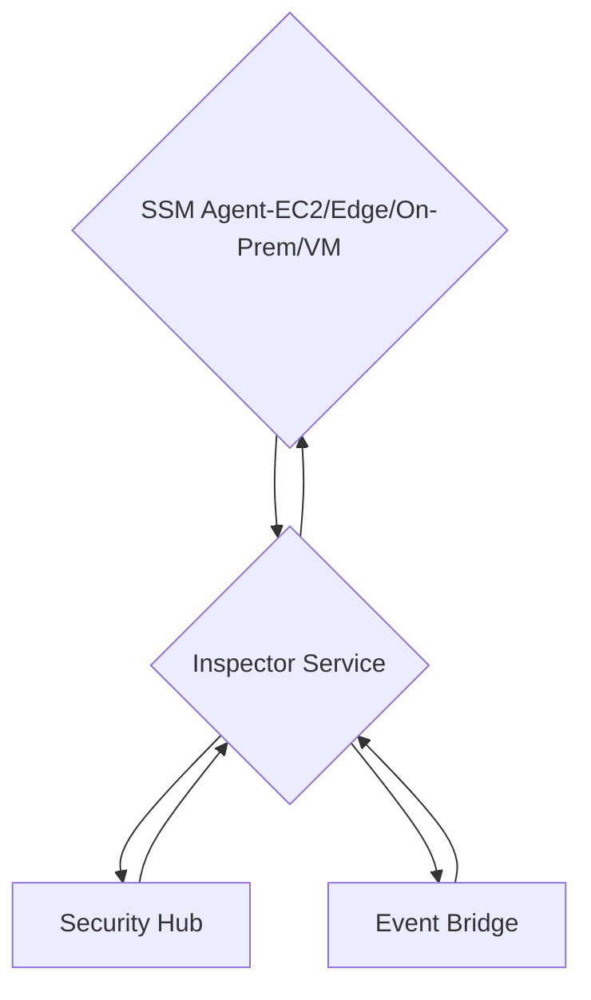
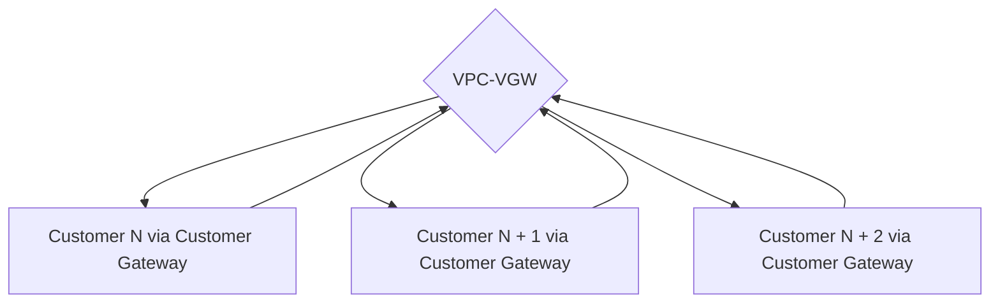
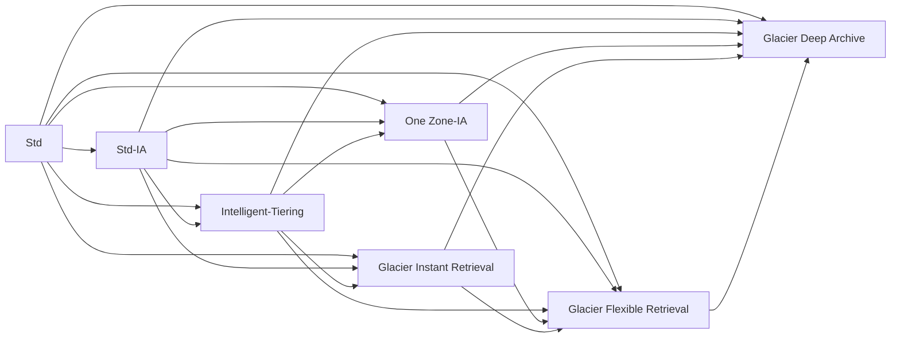
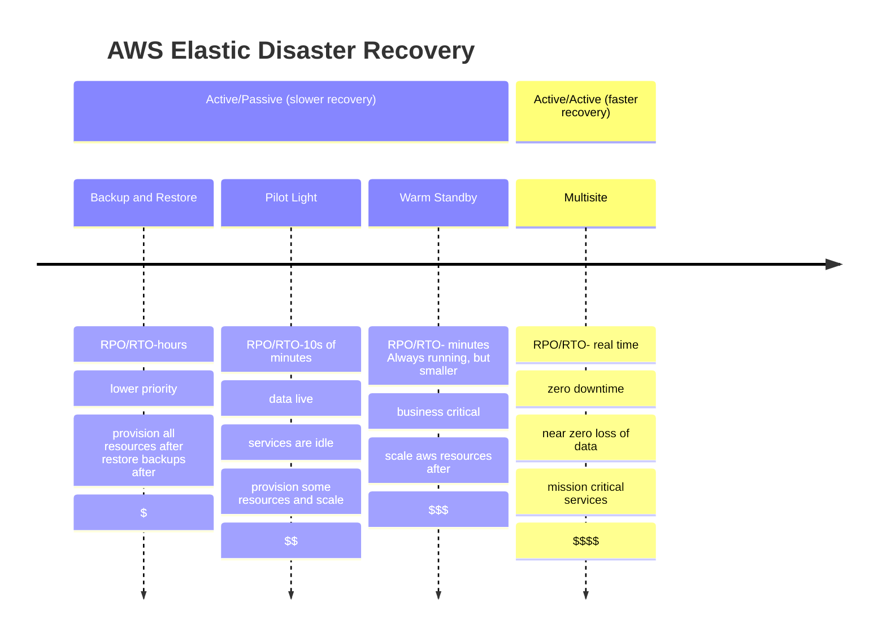
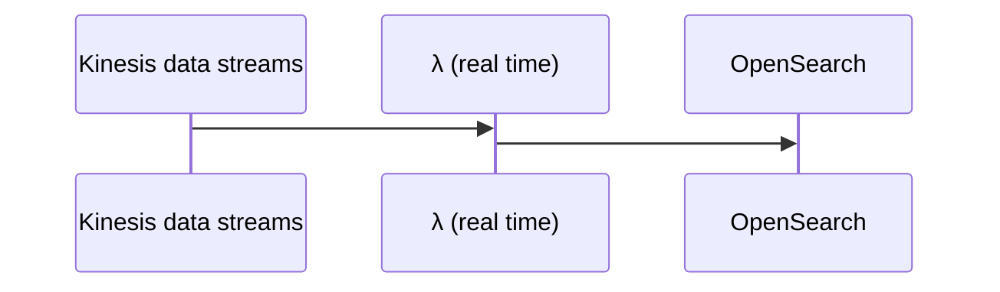

# AWS SAP-CO2 Study Guide
The following guide is my attempt at helping myself and possibly others to pass the AWS Certified Solutions Architect Professional Exam.  I'd recommend taking Stephane Maarek's course [Ultimate AWS Certified Solutions Architect Professional 2023](https://www.udemy.com/course/aws-solutions-architect-professional/) and taking a few practice exams from [AWS Certified Solutions Architect Professional Practice Exam](https://www.udemy.com/course/aws-certified-solutions-architect-professional-aws-practice-exams/) before moving onto the exam.  

Note: The author makes no promises or guarantees on this guide as this is as stated, a guide used by myself, nothing more.  This is a work in progress and I haven't passed the test, yet.  

## Table of Contents
1. <a href="#introduction">Introduction</a>
2. <a href="#organizational-unit-ou">Organizational Unit (OU)</a>
3. <a href="#identity-and-access-management-iam">Identity and Access Management (IAM)</a>
4. <a href="#networking">Networking</a>
5. <a href="#ec2">EC2</a>
6. <a href="#containers">Containers</a>
7. <a href="#logging-events-and-aws-messaging">Logging, Events, and AWS Messaging</a>
8. <a href="#configurations-and-security">Configurations and Security</a>
9. <a href="#vpc">VPC</a>
10. <a href="#storage">Storage</a>
11. <a href="#database">Database</a>
12. <a href="#analytics">Analytics</a>
13. <a href="#infrastructure-as-code-iac--platform-as-a-service-paas">Infrastructure as Code (IAC) / Platform as a Service (PAAS)</a>
14. <a href="#optimization">Optimization</a>
15. <a href="#miscellaneous">Miscellaneous</a>
16. <a href="#acronyms">Acronyms</a>

## Introduction
<a href="https://d1.awsstatic.com/training-and-certification/docs-sa-pro/AWS-Certified-Solutions-Architect-Professional_Exam-Guide.pdf">AWS Certified Solutions Architect - Professional (SAP-C02) Exam Guide</a>


<a href="https://certmetrics.com/amazon/candidate/benefit_summary.aspx">Don't forget to utilize a benefit code if you've passed another AWS exam previously to save</a>

### Exam Content Breakdown:

| Domain  | % of Exam |
| ------------- | ------------- |
| Domain 1: Design Solutions for Organizational Complexity  | 26%  |
| Domain 2: Design for New Solutions  | 29%  |
| Domain 3: Continuous Improvement for Existing Solutions | 25% |
| Domain 4: Accelerate Workload Migration and Modernization | 20% |
| **Total** | **100%** |

## Organizational Unit (OU)

### AWS Organizations
  * Global service
  
  * Allows management of multiple AWS accounts (Dev/QA/Test/etc.)
  * The main account is the management account, while other accounts are member accounts
  * Member accounts can only be part of one organization
  * Consolidated Billing across all accounts - single payment method
  * Pricing benefits from aggregated usage (volume discount for EC2, S3...)
  * Shared reserved instances and Savings Plans discounts across accounts
  * API is available to automate AWS account creation 
  * Advantages
    * Multi Account vs One Account Multi VPC 
    * Use tagging standards for billing purposes
    * Enable CloudTrail on all accounts, send logs to central S3 account   
    * Send CloudWatch Logs to central logging account
    * Establish Cross Account Roles for Admin purposes 
  * Lacks automation and governance features as seen in AWS Control Tower

### AWS Account Organizational Unit Migration:
  * Remove the member account from the former organization [need root or IAM access to said member account and master account(s)]
  * Send an invite to the member account from the prospective organization
  * Accept the invite from the prospective organization upon the member account
  * Ensure the OrganizationAccountAccessRole is added to the member account

### AWS Control Tower:
  * Easy way to setup and govern a secure and compliant multi-account AWS environment based on best practices and using AWS OU to create accounts
  * automates setup of environments in a few clicks
  * automates ongoing policy management using guard rails:
    * SCP: preventative
    * AWS Config: detective
    * CloudTrail Logging: detective
  * detects policy violations and remediates them
  * monitor compliance through dashboards

### Service Control Policies (SCP):
  * Policies for OUs to manage permissions within, helping accounts stay within control by setting limits/guard rails
  * No permissions are granted by SCP, still IAM, but the effective permissions are the intersection of IAM, SCP, and IAM permissions boundaries allowing access
  * OU must have all features enabled to utilize.
  * Affects member accounts and attached users and roles within including the root user(s), not management accounts.
  * Doesn't affect resource-based policies directly.
  * Doesn't affect service-linked roles, which enable other AWS services to integrate with AWS OUs.
  * If disabled at the root account, all SCPs are automatically detached from OU under that root account.  If re-enabled all accounts there under are reverted to full AWS Access (default)
  * Must have an explicit allow (nothing allowed by default like IAM) which is similar to IAM permissions boundary (if not in boundary => deny)

## Identity and Access Management (IAM)

### Allow vs Deny: If any denial in policy is present, the resource is denied regardless of the allow statement(s).  The default behavior is to deny resource(s) and resource(s) need allow statements to be allowed.  

### LDAP: software protocol for enabling the location of data about organizations, individuals, and other resources in a network.  

### IAM role
  * Can be used to delegate access permissions to users or services that normally don't have access to your organization's AWS resources
  * Able to allow access to cross-account resources

### Identity federation: a system of trust between two parties for the purpose of authenticating users and conveying information needed to authorize their access to resources.

### User groups can only contain users

### S3 Bucket Policies vs Access permissions:
  * Used to add or deny permissions across some or all S3 objects in a bucket, enabling central management of permissions
  * Can grant users within an AWS account or other AWS accounts to S3 resources
  * Can restrict based on request time (Date condition), request sent using SSL (Boolean condition), requester IP Address (Ip address condition) using policy keys
  * User access to S3 => IAM permissions
  * Instance (EC2) access => IAM role
  * Public access to S3 => bucket policy

| Type of Access Control | Account Level Control | User Level Control |
| ------------- | ------------- | ------------- |
| IAM Policies | No | Yes |
| ACLs | Yes | No |
| Bucket Policies | Yes | Yes |

### IAM Credentials Report: IAM security tool that lists all your AWS accounts, IAM users, and the status of their various credentials; good for auditing permissions at the **account level**

### IAM Access Advisor: shows the service permissions granted to a user and when those services were last used; can use this information to revise policies at the **user level**

### AWS Policy Simulator: used to test and troubleshoot IAM policies that are attached to users, user groups, or resources.  

###  IAM Access Analyzer: service to identify unintended access  to resources in an organization and accounts, such as Amazon S3 buckets or IAM roles, shared with an external entity to avoid security risk(s)

### IAM Policy Evaluation Logic:


### Amazon Cognito:
  * Web Identity federation service/identity broker handling interations between application(s)/resource(s) and Web IdPs.
  * Capable of synchronizing data from multiple devices using SNS to send notifications to all devices associated with a given user upon data deltas (IAM policy can be tethered to user IDs possibly).
  * User pool: user-based; handling user registration, authentication, and account recovery.
    * Compatible IDPs: Facebook, Amazon, Google, Apple, OpenID Connect providers, SAML
  * Identity pool: receives authentication token to authorize access to resources directly or through the API GW.
    * Maps to IAM role(s)
    * default IAM role(s) for authenticated/guest users

### AWS Resource Access Manager (RAM):
  * Share AWS resources that you own with other AWS accounts (within OU or any account)
  * Aids in avoiding resource duplication by sharing things such as:
    * VPC subnets (owner can share +1 subnets with other accounts in the same OU):
      * Allows all resources (EC2, etc.) launched in the same VPC
      * Must be from the same OU
      * Can't share SGs and default VPC
      * Users can manage their own resources, but can't modify, view, or delete other's resources
      * VPC by itself can't be shared
    * AWS Transit Gateway
    * Route 53 Resolver Rules
    * Licence Manager Configurations across accounts using Private IP(s)

## Networking

### API Gateway:
  * Essentially a front door to AWS resources (λ/EC2/Dynamodb/etc.)
  * Can cache for increased performance
  * Able to throttle
  * Low cost
  * Scales
  * Can enable/disable CORS
  * Handle security (Authentication [*Integrates with Cognito User Pools*]/Authorization[IAM-internal AWS]) 
  * Create API keys
  * Swagger/Open API import to define APIs
  * Can create/manage APIs that are
     * HTTP-method based (eg: GET/POST/etc.)
     * Enable stateless RESTful API client-server communication
     * Enables stateful Websocket APIs, harnessing full-duplex communication between client and server, routed per message content 
  * Custom Domain name HTTPS security integration with ACM
    * If Edge-Optimized=>certificate in US-East-1
    * If Regional=>certificate in API Gateway region
    * Must setup CNAME or A-Alias record in Route 53
  * Endpoints:
    * Edge-Optimized: Cloudfront Edge Locations (API GW 1 region)
    * Regional: clients/API GW in the same region
    * Private: VPC accessible via VPC endpoint with resource policy

### Load Balancers
  * Sticky Sessions (disable if you want traffic to flow to all instances [eg: good for read-only at the instance level]:
    * CLB=> session tied to EC2 instance
    * ALB=> tied to Target Group Level
  * Can check HC of instances
  * Cross Zone Load Balancing enables a balance of traffic to be routed externally to another AZ, equally distributing across all instances
  * Fixed hostname
  * Can have path route patterns that dictate where traffic goes (AZ-inst[s])
    * CLB: HTTP(S), TCP, SSL (secure TCP)
    * ALB: HTTP(S), web sockets
    * NLB: TCP, TLS (secure TCP), UDP
    * GLB: layer 3 (IP Protocol)
  * Use X-Forwarded-For header to see IPv4 address (V2)
  * 504 Error means gateway timed out, application not responding within the idle timeout period (attributed to DB or Web Server)

#### Elastic Ip
  * Can be used to mask failure for an instance (EC2) by remapping the address of another instance providing HA, though cheaper than an ALB
  * Proper role (eg: EC2 Instance Role) needs to be assigned to perform the necessary API calls to assign

#### Application Load Balancer (ALB):
  * Best suited for load balancing HTTP(s) traffic, operating @layer 7 (WebSockets)
  * HTTP traffic following the load balancer doesn't need encryption => port 80
  * Has a static DNS name (not IP, so no attaching Elastic IP Address) => uses private IP of associated ENI for requests forwarded to web server
  * Reserved ALB cookie names: AWSALBAPP, AWSALBTG, AWSALB
  * Can load multiple SSL certificates on one listener that specifies the hostname via SNI
  * Redirects HTTP=>HTTPS
  * Target groups => EC2 (autoscale), ECS, λ, private IP address
  * Health checks are at the target group level
  * Routing based on URL, hostname, query string parameters, or headers
  * X-Forwarded-For header for client IP
  * Sticky sessions available, via cookie (AWSALB)
  * Custom Cookie name must be specified for each target group (all cookies < 4KB)
  * Cross-zone LB is free and always on (can’t be disabled), though at the target group level, cross-zone load balancing can be disabled
  * Integrates with Cognito User Pools

#### Elastic Load Balancer (ELB/CLB):
  * Legacy load balancer that can load balance http(s) applications and use layer-7 specific features, such as X-Forwarded and sticky sessions
  * Can also use strict Layer 4 load balancing for applications that rely purely on TCP protocol
  * HTTP traffic following the load balancer doesn't need encryption => port 80
  * Has a static DNS name (not IP, so no attaching Elastic IP Address) => uses private IP of associated ENI for requests forwarded to web server
  * Health checks are TCP or HTTP
  * Sticky sessions available via cookie (AWS ELB) [all cookies < 4KB]
  * Cross-zone LB is free and disabled by default
  * SNI not available, supports only one certificate

#### Gateway Load Balancer:
  * Used to scale, deploy, and manage a fleet of 3rd party network virtual appliances in AWS (eg: Firewalls, Intrusion Detection and Prevention System[s], Deep Packet Inspection System[s], payload manipulation)
  * Operates @layer 3 (Network layer) IP packets
  * Combines *Transparent Network Gateway* - single entry/exit for all traffic and *Load Balancer* -distributes traffic to virtual appliances
  * Use Geneve protocol on port 6081
  * Target groups: EC2, private ip address(es)
  * Cross zone LB is $ per use and disabled by default

#### Network Load Balancer (NLB):
  * Best suited for load balancing of TCP/UDP traffic where extreme performance is required, operating @layer 4
  * Capable of handling millions of requests per second, while maintaining ultra-low latency
  * Has one static, public IP address per AZ (can attach elastic IP to this)
  * Can load multiple SSL certificates on one listener that specifies the hostname via SNI
  * Health checks are TCP or HTTP(S)
  * Target groups: EC2, private ip address(es), ALB
  * X-Forwarded-For header for client IP
  * Cross zone LB is $ per use and disabled by default
  * If targets specified via instance id => primary private ip specified in primary network interface
  * If targets specified via IP(s) => route traffic to instance via private IP from one or more network interfaces, allowing multiple applications to use the same point
  * Now supports SG(s)

#### Connection Draining (ELB)/Deregistration Delay (ALB and NLB):
  * Time to complete "inflight request(s)" while instance is unhealthy/de-registering
  * Stops sending new request(s) to EC2 instance which is de-registering
  * Between 1 to 3600 seconds (default: 300 seconds)
  * Can be disabled (set to 0 seconds)
  * Set to low value if requests are short
  
### Health Checks
  * Only pass when HTTP endpoint response: 2xx/3xx
  * Route 53 health check => Automated DNS Failover:
    * Works with weighted routing, latency-based, geolocation, and multivalue routing policies
    * Doesn't work with simple routing policy
    * HC that monitors an endpoint (application, server, other AWS resource)
    * HC that monitors other health check(s) or combination of them (Calculated HC)
      * Can use use OR, AND, NOT
      * Can monitor up to 256 Child HC(s)
      * Specify how many must pass to make parent HC pass
  * HC that monitors CloudWatch Alarms from CloudWatch metrics (helpful for VPC private resources as VPC inaccessible endpoint to HC)
  * HC can pass/fail based on the text of the first 5120 bytes of the response
  * Configure router/firewall to allow incoming Route 53 HC requests

### AWS Global Accelerator:
  * Network service that helps improve the availability and performance of the application(s) to global users
  * Provides (2) Anycast/static IP addresses providing a fixed entry point (no client cache issues=>static ip) at edge locations (from/to) to your application(s) and eliminates the complexity of managing specific IP addresses for different regions and AZs.
  * Always routes user traffic, leveraging the internal AWS network, to the optimal, lowest latency endpoint based on performance, reacting instantly to HC changes, user's location, and policies configured.
  * (Regional) Failover < 1 minute for unhealthy application(s)=>great for disaster recovery
  * Good fit for non-HTTP use cases such as sports/gaming (UDP), TCP, IoT (MQTT), or VOIP
  * Works with Elastic IP, EC2, ALB, NLB, public or private
  * Can control traffic using traffic dials within an endpoint group 

### Amazon Route 53:
  * AWS service for DNS routing/Domain registration
  * More Route 53 traffic, more $
  * ELB can't throttle
  * ELB doesn't have predefined ipv4 addresses (resolve using DNS name)
  * Alias (hostname to the AWS resource)=> better choice mostly (not 3rd party websites)
  * CNAME (hostname to hostname)=>can't use the root domain utilizing this
  * Common DNS types:
    * SOA records
    * NS records
    * A records
    * MX records
    * PTR records
  * TTL is mandatory for all records except alias
  * Routing Types:
    * Simple
    * Multi value=> kind of like simple
    * Weighted
    * Latency
    * Geolocation (note this doesn't really help with latency)
    * Geoproximity (traffic flow only)
  * Can't mitigate DNS caching
  * External certificates are registered with 3rd party NS registrar
  * HC=> used for failover (ALB=>http(s) HCs)
  * Route 53 HC(s) only for public resources, VPC must make a CloudWatch metric/alarm for HC to monitor
  * Alias can't reference EC2 DNS name

### Route 53 Resolver:
  * Able to connect to AWS infrastructure and/or infrastructure outside of AWS
  * AWS side:
    * By default, Route 53 Resolver automatically answers DNS queries for local VPC domain names with EC2 instances
    * You can integrate DNS resolution between Route 53 resolver and DNS resolvers on your on-premises network by configuring forwarding rules
    * *DNS revolvers on the on-premises network can forward DNS queries to Route 53 Resolver **via an inbound endpoint ONLY**, not an outbound endpoint, to resolve AWS services to infrastructure
  * On-premises:
    * *Route 53 Resolver can conditionally forward queries to resolvers on the on-premises network via an **outbound endpoint ONLY**, not an inbound endpoint to resolve to on-premises infrastructure*
    * To conditionally forward queries, you need to create Resolver rules that specify the domain names for the DNS queries that you want to forward and the IPs of the DNS resolvers on the on-premises network that you want to forward the queries to

### Route 53 Records:
  * Each record contains:
    * Domain/subdomain name (eg: example.com)
    * Record type (eg: A or AAAA)
    * Value (eg: 12.34.56.89)
    * Routing Policy: how to respond to queries
    * TTL: the amount of time the record is cached at DNS Resolvers
  * Top-level Domain (TLD) =>.com, .org, etc.
  * Second Level Domain (SLD)=>google.com
  * Record Types: 
    * A-maps to ipv4
    * AAAA-maps to ipv6
    * CNAME (must be A or AAAA record)
    * NS-Name servers for the *Hosted Zone*, which is a container for records that control route traffic to domain(s)/subdomain(s)
  * Public hosted zones=>traffic on the internet
  * Private hosted zones=>traffic to VPC(s)
    * For each associated VPC with a Route 53 Hosted Zone, the following VPC settings need to be set to true: enableDnsHostnames and enableDnsSupport
  * Targets: ELB, CloudFront, API Gateway, Elastic Beanstalk environment, S3 Website(s), VPC interface endpoints, Global Accelerator, Route 53 record in the same hosted zone

### Amazon CloudFront
  * Serverless service used to scale, save network bandwidth, and deliver entire website(s), including dynamic, static, streaming, and interactive content using a global network of edge locations, sending requests to the nearest edge location through such options as:
   * Web distribution - websites (no architecture change)
   * RTMP - used for media streaming
   * Edge Location (λ@edge) where content is cached.  Separate from an AWS Region/AZ.  Can be written to as well
   * Origin-origin of all files CDN distributes (S3 bucket, EC2, ELB, or Route 53)
   * Distribution:
     * Name given to a global CDN consisting of a collection of Edge Locations
     * Necessitates minimal refactoring to point at instead of EBS/EFS/etc. cutting down on network costs
     * Can be used in front of an ALB
  * Can route to multiple origins based on content type (dynamic => ELB, static => S3)
  * Options for securing content: HTTPS, geo-restriction, signed URL/cookie, field level encryption, AWS WAF
  * Can't be associated with SGs
  * Objects can be cached for TTL
  * Can clear cached objects, but you will be charged
  * Price classes:
    * All Regions - best performance - $$$
    * 200 - $$
    * 100 - $ only least expensive regions
  * Supports primary/secondary origins for HA/failover (specific HTTP responses)
  * Supports field-level encryption (not KMS) @edge to protect sensitive data
  * works from edge locations and external to any VPC
  * Serverless, cheaper to scale

### Unicast IP vs Anycast IP:
  * Unicast: one server holds one IP
  * Anycast: all servers hold the same IP and the client is routed to the nearest one

### CloudFront Signed URLs/Cookies:
  * Use signed URLs/cookies when you want to secure content for authorized users
  * Signed URL is for 1 individual file 
  * Signed Cookie is for multiple files (sitewide)
  * If the origin is EC2, use CloudFront Signed URLs/Cookies
  * If the origin is S3, use the S3 Signed URL (same IAM access as creator's IAM)
  * Policies:
   * Limited lifetime
   * IP ranges
   * Trusted signers (which AWS accounts can create signed URLs)
   
### AWS Global Accelerator vs Cloudfront:
  * They both use the AWS global network and edge locations around the world
  * Both services integrate with AWS Shield
  * Cloudfront: 
    * Improves performance for both cacheable content
    * Dynamic content (API acceleration and dynamic site delivery)
    * Content served at the edge
  * Global Accelerator:
    * Improve performance of applications using TCP/UDP
    * Proxying packets at the edge to applications running in one or more AWS Regions
    * Good fit for non-HTTP cases (eg: Gaming [UDP], IOT (MQTT), VOIP)
    * Good for HTTP use cases requiring static IP addresses
    * Good for HTTP use cases requiring deterministic, fast regional failover 

### AWS PrivateLink:
  * Service allowing you to open your service in VPC to another VPC (using PrivateLink)
  * Allows exposure of VPC service to tens, hundreds, or thousands of other VPCs
  * Doesn't require VPC peering; no route tables, NAT, IGWs, etc.
  * Requires a NLB on the service VPC and an ENI on the customer VPC
  * If issue(s): Check DNS setting Resolution in VPC and/or check the the Route Tables

### AWS Direct Connect
  * Service that makes it easy to establish a dedicated network connection from on-premises to AWS VPC.  
  * Using Direct Connect, you can establish private connectivity between AWS VPC and your datacenter/co-location environment, which can reduce network costs, increase bandwidth throughput, and provide a more consistent network experience than internet-based connections
  * Can access private/public AWS resources
  * Useful for high throughput workloads (eg: lots of network traffic)
  * Good if you need a stable and reliable secure connection
  * Takes at least a month+ to setup
  * Supports IPV4/6
  * Can use Direct Connect Gateway if Direct Connect available between one VPC already
  * AWS Direct Connect + VPN => encrypted
  * Dedicated: 1 GBps to 10 GBps
  * Hosted: 50 MBps, 500 MBps, up to 10 GBps
  * Public Virtual Interface (VIF): used to connect an on-premises network to public AWS resources (eg: S3, DynamoDB, etc.) over public IPs via prefixes routed through Direct Connect privately
  * Private VIF: used to connect an on-premises network to VPC resources over private IP addresses 

### CIDR:
  * Used to provide an IP range
  * VPCs per region: 5
  * Subnets per VPC: 200
  * Max CIDR size in AWS is /16
  * If EC2 can't launch in subnet examine IPV4 CIDR (even if IPV6 used)
  * If connecting networks, CIDR must not overlap each respective CIDR
  * Used in SG rules
  * IPV4 can't be disabled in VPC
  * Octets (1st 2nd 3rd 4th)
    * /32 => no octet change
    * /24 => last octet change
    * /16 => last 2 octets change
    * /8 => last 3 octets change
    * /0 =>all octets can change
  * Example subnet masks:
    * /32 => 2^0 => 1 IP       => 192.168.0.0
    * /31 => 2^1 => 2 IPs      => 192.168.0.0 => 192.168.0.1
    * /30 => 2^2 => 4 IPs      => 192.168.0.0 => 192.168.0.3
    * /29 => 2^3 => 8 IPs      => 192.168.0.0 => 192.168.0.7
    * /28 => 2^4 => 16 IPs     => 192.168.0.0 => 192.168.0.15
    * /27 => 2^5 => 32 IPs     => 192.168.0.0 => 192.168.0.31
    * /26 => 2^6 => 64 IPs     => 192.168.0.0 => 192.168.0.63
    * /25 => 2^7 => 128 IPs    => 192.168.0.0 => 192.168.0.127
    * /24 => 2^8 => 256 IPs    => 192.168.0.0 => 192.168.0.255
    * /16 => 2^16 => 65536 IPs => 192.168.0.0 => 192.168.255.255
    * /0 => All IPs            => 0.0.0.0 => 255.255.255.255

### VPC CIDR unavailable IPs in subnets:
  * AWS reserves 5 addresses (first 4 and last 1) in each subnet that can't be used
  * Example 10.0.0.0/24:
    * 10.0.0.0=>network address
    * 10.0.0.1=>reserved by AWS for the VPC router
    * 10.0.0.2=>AWS for mapping Amazon provided DNS
    * 10.0.0.3=>AWS for future use
    * 10.0.0.255=>Network broadcast address.  AWS doesn't support broadcast in VPC, therefore this is reserved

## EC2

### Instance Purchasing Options:

#### EC2 On-Demand Instance:
  * Pay by the second for the instances launched after the first minute
  * Can't be used for existing server-bound software licenses

#### EC2 Savings Plan Instance:
  * 1 or 3-year terms available
  * Commitment to an amount of usage, long workload
  * Beyond usage is billed at the On-Demand rate
  * Locked to a specific instance family/region
  * Flexible across instance size, OS, Tenancy (Host, Dedicated, Default)
  * Can be shared across AWS Organization accounts

#### EC2 Reserved Instance:
  * Committed/consistent instance configuration, including instance type and region for a term of 1 or 3 years
  * Great for cost optimization
  * Can be shared across AWS Organization accounts
  * Can't be used for existing server-bound software licenses

#### EC2 Convertible Reserved Instance:
  * One of the reserved instance purchasing options (1 or 3 years)
  * Good for long workloads with flexible instance type(s)
  * Can change EC2 type, instance family, OS, scope, and tenancy

#### EC2 Dedicated Instance:
  * EC2 instances that run in a VPC on hardware dedicated to customer use
  * Physically isolated at the hose hardware level from instances belonging to other AWS accounts
  * May share hardware with other instances from the same AWS account that aren't dedicated instances
  * Can't be used for existing server-bound software licenses

#### EC2 Dedicated Host Instance:
  * EC2 instances on physical servers dedicated for customer use
  * Give additional visibility and control over how instances are placed on a physical server over time
  * Enables the use of existing server-bound software licenses and addresses compliance/regulatory requirements
  * On-demand option: pay per second ($$$)
  * Reserved option: 1 or 3-year options with other reserved instances ($ - $$)
  * Costlier than Dedicated Instances

#### EC2 Capacity Reserved Instance:
  * Reserve On-Demand capacity in a specific AZ for any duration
  * No time commitment (create/cancel anytime); no billing discounts and charged On-Demand rate regardless
  * Combine with Regional Reserved Instances and Savings Plans to benefit from billing discounts
  * Suitable for short-term, uninterrupted workloads that need to be in an AZ

#### EC2 Spot Instance:
  * Most cost-efficient EC2 instance, up to 90% off On-Demand rate
  * Can lose at any time if your max price < the current spot price
  * Not suitable for critical jobs or DBs
  * Useful for jobs such as batch jobs, data analysis, image processing, and distributed workloads, workloads with a flexible start/end time
  * Can only cancel Spot Requests that are open, active, or disabled. Canceling a Spot Request doesn't terminate the instances; you must first cancel the Spot Request and then terminate the Spot Instances
  * Don't use if being up for a specific time frame is necessary

#### EC2 Spot Fleets:
  * set of Spot Instances and optional On-Demand Instances
  * Will try to meet target capacity with price constraints defined via possible launch pools, instance type, OS, AZ
  * Can have multiple launch pools from which the fleet can choose
  * Stops launching instances when reaching capacity or max cost
  * Allow automatically to request Spot Instances with the lowest price
  * Strategies to allocate Spot Instances:
    * *Lowest Price*: from the pool with lowest price (cost optimization, short workloads)
    * *Diversified*: distributed across all pools (great for availability, long workloads)
    * *Capacity Optimized*: pool with the optimal capacity for the number of instances

#### EC2 Spot Blocks (aka Spot Duration):
  * "block" spot instance during a specified time frame (1 to 6 hours) without interruptions
  * In rare situations, the instance may be reclaimed
  * Not available to new customers

#### EC2 SG configurations:
  * source (inbound rules) or destination (outbound rules) for network traffic specified via the following options:
    * Single ipv4 (/32 CIDR) or ipv6 (/128 CIDR)
    * Range of ipv4/ipv6 address (CIDR block notation)
    * Prefix List ID for the AWS service(s) via Gatway Endpoints, (eg: p1-1a2b3c4d)
    * Another SG, allowing instances within one SG to access instances within another.  Choosing this option doesn't add rules from the source SG, to the 'linked' SG.  You can specify one of the following:
     * Current SG
     * Different SG for the same VPC
     * Different SG for a peer VPC in VPC peering connection

### EC2 Placement Groups

#### Cluster Placement Group:
  * Clusters instances into a low-latency group in a single AZ
  * Great network speeds (10 GBps bandwidth between instances with enhanced networking enabled; recommended)
  * If the rack fails, all instances fail at once
  * Use cases:
    * Big data job that needs to be completed fast
    * Application that needs extremely low latency and high network throughput

#### Partition Placement Group:
  * Spreads instances across many different partitions (which rely on different sets of racks) within an AZ
  * Scales to 100s of instances per group
  * Up to 7 partitions per AZ and can span multiple AZs in the same region
    * Instances in a partition don't share racks with the instances in other partitions
    * Individual partition failure can affect many EC2, but won't affect other partitions
    * EC2 instances get access to the partition metadata
  * Use cases: HDFS, HBase, Cassandra, Kafka, Hadoop (distributed and replicated workloads)

#### Spread Placement Group:
  * Spreads instances across underlying hardware (max 7 instances per group per AZ)
  * Can span across AZs
  * Reduced risk of simultaneous failure
  * EC2 instances on different physical hardware
  * Use cases:
    * Maximal HA
    * Critical Application where each instance must be isolated from failure from each other

### EC2 Instance Types:

#### Compute Optimized: good for high performance jobs such as batch processing, transcoding, high performance web servers, HPC, Modeling, ML, gaming servers

#### Storage Optimized: good for jobs requiring high, successive read and write access to datasets/DBs locally such as high frequency OLTP systems, relational/non-relational DBs, cache for in-memory DBs, data warehousing applications, distributed file systems

#### Memory Optimized: good for fast performance jobs using large datasets in memory such as high peformance relational/non-relational dbs, distributed web scale cache stores, in-memory DBs optimized for BI, applications performing real-time processing of big unstructured data

#### General Purpose: good for jobs such as web servers or code repos balancing compute, memory, and networking

### EC2 Instance Recovery: same private IP, public IP, elastic IP, metadata, placement group, instance ID after failure

### EC2 User Data:
  * Used to perform common automated, dynamic, configuration tasks and even run scripts after and instance starts
  * When an EC2 launches, you can pass 2 types of user data, shell script(s) and cloud-init directives.  This can be passed into the launch wizard as plain text or a file
  * *By default, shell scripts entered as user data are executed with root privileges (no sudo command necessary)*
  * If non-root users are to have file access, modify the permissions accordingly via shell scripting
  * *By default, user data runs only during the boot cycle when the EC2 is first launched*
  * Alternatively, configuration(s) can be updated to ensure user data scripts and cloud-init directives can run every time an EC2 instance is restarted

### EC2 Hibernate:
  * In-memory state is preserved
  * Instance boot time is much faster (OS is not stopped/restarted)
  * Memory state is written to a file in root EBS of the EC2 instance
  * RAM must be less than 150GB
  * Root EBS must be encrypted
  * Can't use hibernate beyond 60 days
  * Available for the following EC2 Options: On-Demand, Reserved, and Spot Instances
  * Use cases: long-running processing, saving memory state, services that take a long time to initialize
  
### Elastic Fabric Adapter:
  * Improve ENA *for HPC*, only works for Linux
  * Enabled with *AWS Parallel Cluster*
  * Great for inter-node communications, tightly coupled workloads
  * Leverage MPI standard
  * Bypasses the underlying Linux OS to provide low-latency, reliable transport

### EC2 Enhanced Networking:
  * Higher bandwidth, higher PPS, lower latency
  * Option 1: ENA up to 100GBps
  * Option 2: Intel 82599VF up to 10 Gbps (legacy)
  
### AWS Scaling Policies:
  * Dynamic Scaling:
    * *Target-Tracking* scaling: most simple/easy to setup (eg: I want the average ASG CPU to stay around 40%)
    * *Simple/Step* scaling:
      * When CloudWatch is triggered (example CPU > 70%), then add 2 units
     * When CloudWatch is triggered (example CPU < 30%), then remove 1 unit
  * Scheduled Actions:
    * Anticipate a scaling based on known usage patterns (eg: increase the minimum capacity to 10 at 5 PM on Fridays)
  * Predictive Scaling: continuously forecast load and schedule scaling ahead
  * Scaling Cool down: following in/out, no further in/out (default 300 seconds)
  * Good metrics: CPU utilization, Request Count Per Target, Average Network In/Out, any custom CloudWatch metric
  * ASG is a good match with keywords such as "dynamic", "change", "capacity"

### Amazon EC2 Auto Scaling:
  * Enables users to automatically launch/terminate strictly EC2 instances based on configuration parameters, such as when a specific metric exceeds a threshold (via CloudWatch) or during a certain scheduled period to scale appropriately
  * Schedule action sets the min, max, or desired sizes to what is specified by the scheduled action. Min and max set a range of indeterminate instances, while desired specifies what is needed at a said time
  *  Relies on predictive scaling, which uses ML to determine the right amount of resource capacity necessary to maintain a target utilization for EC2 instances
  * Target tracking or simple tracking can't be used to effect scaling actions at a designated time
  * *Launch configuration* can't be used in combination of spot and on-demand instances
  * *Launch templates* can mix instances
  * Can't modify launch configurations once created
  * Do not pay to use the service, but do pay for the underlying resources and services used by it.
  * If AZ rebalancing (cross-zone LB) needs to be considered, instances are launched before terminating instances so as to not impact performance or activity, with such causes as:
    * Changes to a group within an AZ
    * Instances terminated or detached
    * AZ in recovery that recoverd and has more capacity than necessary
    * AZ spot price was previously above your max price, but is now fallen below that measure
  * If AZ rebalancing doesn't need to be considered, and an unhealthy instance is encountered, a scaling activity to terminate the instance must take place prior to the replacment instance scaling activity

### AWS Auto Scaling:
  * Centralized service to manage configuration from a wide range of scalable resources, such as EC2 instances/spot fleets/Auto Scaling groups, ECS, DynamoDB global secondary indexes or tables (RCU/WCU) or RDS (Aurora) read replicas based on utilization targets or metrics and thresholds for applications hosted on AWS
  * Introduced scaling plans that manage resource utilization to target utilization such as CPU at 50%, which could add/remove capacity to achieve
  * Can configure a unified scaling polity per application, via eg: Cloudformation stack or a set of resource tags.  From this means, scalable resources that support the application can be added to the scaling plan, and define the utilization targets based on which of the resources should scale.  Can prioritize availability, cost optimization or a combination of both.  
  * Do not pay to use the service, but do pay for the underlying resources and services used by it.

### AWS EC2 ASG maintenance
  * Suspend *ReplaceUnhealthy* process type for the ASG and perform maintenance on the targeted EC2 instance.  Following this, set the instance health status to healthy and the *ReplaceUnhealthy* process type can be set to active, again.
  * Set the targeted EC2 instance to a Standby state, perform maintenance, and toggle off the Standby state.

### ASG not terminating EC2 instances
  * Doesn't terminate instance(s) that came into service based on EC2 status check and ELB health checks until grace period expires
  * Doesn't immediately terminate instances with an impaired status or instances that fail to report data for status checks, which for the latter usually happens when there is insufficient data for the status check metric in Amazon CloudWatch
  * By default, EC2 Autoscaling doesn't use ELB health checks when the group's health check configuration is set to EC2.  This results in the EC2 Autoscaling not terminating instances that fail ELB health checks.  If an instance status is out of service on the ELB console but is healthy on the Amazon EC2 Autoscaling console, confirm that the health check type is set to ELB

### Amazon EC2 Autoscaling Termination: the following list is in decreasing precedence
  * Determine which AZ has the most instances and at least one instance that isn't protected from scale in
  * Determine which instances to terminate to align the remaining instances to the allocation strategy for the on-demand/spot instances it is terminating (template)
  * Determine if the instance uses the oldest launch template or config (config is terminated first before template if there is a mix of the two)
    * Template/config => choose the instance(s) using the old version
  * If multiple unprotected instances are to terminate, determine which instances are closest to the next billing hour (note Linux/Ubuntu instances are billed by the second)

## Containers

### Amazon Elastic Container Registry (ECR):
  * private/public container storage alternative to docker hub
  * container =>image
  * Backed by S3
  * Access controlled by IAM
  * Harnessed by ECS, EKS, Fargate
  * Supports vulnerability scans, versioning, image tags, image lifecycle

### Amazon ECS:
  * Has to launch types: Amazon EC2 and Fargate
  * Fargate has to use either EFS volume, FSx for Windows, docker volumes, or bind mount (file or dir)
  * EC2 has to harness an EFS volume amount instances, not EBS
  * ECS Autoscaling=>target tracking metrics:
    * ECSSVCAVECPU
    * AveCPU use
    * ECSSVCAVEMEM-average memory use
    * ALBRequestCountPerTarget-number of requests per target in ALB target group
  * Can be scaled in/out per EventBridge invoked rules/schedule
  * IAM roles: 
    * EC2 Instance Profile (EC2 only)-used by ECS agent, makes API calls to ECS service, sends container image from ECR, references sensitive data in Secrets Manager or SSM Parameter Store
    * ECS Task Role allows each task to have a specific role, use different roles for different ECS services you run, task role is defined in the task definition

### Amazon EKS:
  * Managed node groups: 
    * Create/Manage nodes (EC2) 
    * Nodes are part of ASG managed by EKS
    * Supports On-Demand or Spot Instances
  * Self-managed nodes:
    * Nodes created by you, registered to the EKS cluster, and managed by an ASG
    * Can use prebuilt AMI-Amazon EKS Optimized AMI
    * Supports On-Demand and Spot Instances
  * Need to specify storage class on EKS cluster, leveraging Container Storage Interface (CSI) compliant driver: EBS, EFS (Fargate), FSx for Lustre/for NetApp ON TAP
  * EKS Anywhere allows creation/management of Kubernetes clusters on, on-prem servers, edge locations outside of AWS or Outpost resources
  * Doesn't support λ, does support Fargate, Managed Node Groups, and Self-Managed Nodes
  
### λ:
  * Serverless backend capable of supporting container image (must implement λ Runtime API)
  * Free tier => 1,000,000 requests and 400,000 GBs of compute time
  * Pay .20 per 1,000,000 requests after free threshold
  * Pay per duration of memory (in increments of 1 ms) after the free threshold ($1.00 for 600,000 GBs)
  * Up to 10 GB of RAM, minimum 128 MB
  * More RAM improves CPU and network capabilities
  * Environment variables (< 4KB)
  * Does not have out-of-the box caching
  * Regionally based
  * Disk capacity in function container (/tmp) 512 MB to 10 GB
  * Can use /tmp to load other files at startup
  * Concurrency executions: 1000, but can be increased
  * Deployment size: uncompressed 250 MB, compressed 50 MB
  * Can run via CloudFront as CloudFront functions and λ@edge
  * Can create λ layers (up to 5) to reuse code, making deployment smaller
  * Timeout is the maximum amount of time in seconds a λ can run (default 3). This can be adjusted from 1 to 900 seconds (15 minutes).  A low timeout value has increased risk of unexpected timeout due to external service lag, downloads or long(er) computational executions.  
  
### AWS Fargate:
  * Severless backend harnessing ECS/EKS/ECR
  * VPCU
  * Memory
  * AWS runs ECS Tasks for you based on CPU/RAM needed, so to scale, increase the number of tasks
  * Storage resources (20 GB free)
  * No time limit like λ (15 minutes)
  * λ can hit max concurrency problems, or sometimes can't horizontally scale and might throttle, through with error code 429
  * Harnessed EFS, doesn't support mounting EBS volumes

### Amazon Managed Service for Prometheus: serverless monitoring service harnessing PROMQL to monitor and alert on container environments upon ingestion/storage

## Logging, Events, and AWS Messaging

### AWS CloudTrail:
  * Service that monitors and records account activity across AWS infrastructure (history of events/API calls)
  * Provides governance, compliance, and audit for your AWS account:
   * Enabled by default
   * Trail can be applied to all regions (default) or a single region

### CloudTrail Events:
  * Able to be separated into read/write events
  * Management events (default on)
  * Data events (default off due to volume, though can be turned on to trigger/invoke)
  
### CloudTrail Insights:
  * Used to detect unusual activity in an account (if enabled):
   * Inaccurate resource provisioning
   * Hitting service limits
   * Bursts of AWS IAM actions
   * Gaps in periodic maintenance
   * Analyzes normal management events to create a baseline to then continuously analyze write events to detect unusual patterns (S3/CloudTrail console/EventBridge events)
   * CloudTrail Events are stored for 90 days, though can be sent to S3 and analyzed by Athena

### Amazon EventBridge (aka CloudWatch Events):
  * Service to provide connectivity between certain events and resultant services such as
    * CRON job triggering (via EventBridge) a λ 
    * λ triggering (via EventBridge) SNS/SQS messages
    * S3 Event Notifications (via EventBridge) to trigger whatever service is required
    * Event Pattern: rules specified in AWS JSON rule configs react (eg: filter) to certain service action(s) (eg: check for external generated certs that are n days away from expiration, metadata, object sizes, names, etc.)
    * When an EventBridge rule runs, it needs permission on the target (eg: \[λ, SNS, SQS, CloudWatch Logs, API GW, etc.] resource-based policy or \[Kinesis Streams, Sys Mgr Run Command, ECS tasks etc.] IAM Role must allow EventBridge)
    * Externally available to 3rd party SAAS partners
    * Can analyze events and infer an associated schema (capable of versioning).  This registered schema allows code generation for applications to know the structure of the data incoming into the event bus
    * EventBridge Event Buses Types:
      * Default (receive events from AWS services)
      * Partner (receive events from SAAS)
      * Custom (receive from Custom Applications)
    * EventBridge Event Buses:
      * Are accessible to other AWS accounts/Regions via Resource-based policies
      * Events can be archived/filtered sent to it (time-based or forever) and even replayed
      * Multiple destinations at one time are possible

### SQS
  * If writing to it IAM Role permissions are needed by the writer
  * If receiving from SNS, need access policy to allow
  * Queues (eg: SQS) aren't meant for (real-time) streaming of data
  * Guarantees processed at least once
  * Retention in queue from 1 minute to 14 days (default retention is 4 days)
  * Messages are 256k or less
  * Receive up to 10 messages at a time
  * Data deleted after consumption
  * Can have as many consumers as needed
  * Ordering is only guaranteed on FIFO Queues, not standard
  * Std queue: unlimited throughput
  * FIFO queue can limit throughput (300 messages per second)
  * FIFO queue name must have a *.FIFO extension
  * Use separate queues to provide prioritization of work
  * Temporary queues are great for high throughput request-response pattern
    * Lightweight communication channels for threads or processes
    * Created and deleted without additional costs
    * API compatible with normal SQS queues
    * SQS Temporary Queue Client used to create and delete
    * Virtual Queues allow multiplexing many smaller queues onto a single SQS queue and buffered locally to hold messages for consumers without any further SQS API calls
  * Batch mode available with up to 3000 messages per second (batch of 10)
  * To convert to/from standard or FIFO can't modify, must create a new queue
  * For SQS FIFO, if no group id, messages consumed in the order sent with only 1 consumer; if group id is present, can have up to the same number of consumer(s)
  * Can delay message output to consumer (0 sec \[default] - 15 mins
  * Useful for decoupling applications
  * Pull-based data
  * Dead letter queue used to capture messages that encountered exceptions or timed out
    * If an s3 event triggers a processing lambda, yet fails to process it and a DLQ is the requirement, the DLQ is setup within the Lambda function
  * Fanout pattern one SNS =>multiple SQS
  * Can work with ASG via CloudWatch Metric/Alarm - Queue Length (approximate # of messages) to scale either/both producer(s)/consumer(s)
  * Encryption (in flight via HTTP API [requres SSL certificate to enable]/at-rest using KMS/client-side)
  * Access via IAM controls (regulates access to SQS API) and/or SQS Access Policies (useful for cross-account to SQS queues and useful for allowing other users to write to SNS)
  * Short polling is sync polling of a queue and returns a response immediately 
  * Long polling of a queue is async returns when either with a response or when the long poll times out (1-20 sec [receive message wait time]) reducing latency/increasing efficiency
  * Purging will remove all messages from the queue
  * Visibility timeout: Amt of time a message is invisible in the queue after a reader picks the message.  Provided the job processes before the visibility timeout expires, the message will be deleted from the queue.  If the job isn't processed within that time, the message could become visible again and another reader will process it. This could result in the message being delivered more than once.  The max Visibility timeout is 12 hours.  ChangeMessageVisibility Api can be called to get more time
    * Too high=>longer time to process if consumer crashes
    * Too low=>duplicate processing
* Cross-Region Delivery works with SQS queues in other regions

### SNS
  * can create filter policies (JSON) for only certain SQS consumers to receive certain messages from SNS
  * fifo: ordering by message group ID and deduplication using deduplication ID or Content-based deduplication (can only have SQS subscribers)
	 * if writing to SNS, need access policy to allow the write
	 * push-based data
  * simple api for integration
  * available over multiple transport protocols
  * pay as you go, no upfront costs
  * data is not persisted (lost if not delivered)
  * up to 12,500,000 subscribers
  * pub/sub
  * up to 100,000 topics
	 * integrates with SQS for fanout (SNS must be fifo)
  * encryption (in flight via HTTP API [requires SSL certificate to enable]/at-rest using kms/client-side)
  * access via IAM controls (regulates access to SNS API) and/or SNS Access Policies (cross-account access and other services to write to SNS)
  * what can subscribe to SNS?
    * Platform application endpoint
    * SQS
    * HTTP(s) endpoints
    * Email/Email-JSON
    * AWS Lambda
    * Amazon Kinesis Data Firehose
    * SMS
  * What can't subscribe to SNS?
    * Amazon Kinesis Data Streams cannot subscribe to SNS
  * Use Kinesis streams for real-time, concurrent processing of data
  * SNS Publish:
    * Topic Publish (using SDK)
      * create Topic
      * create Subscription(s)
      * publish to Topic
    * Direct Publish (for mobile app SDK)
      * create a platform application
      * create a platform endpoint
      * publish to platform endpoint
      * works with Google GCM, Apple APNS, Amazon ADM

## Configurations and Security

### AWS Certificate Manager (ACM):
  * Service to provision, manage, import, and deploy public and private SSL/TLS certificates for use with AWS services and internally connected resources
  * Removes time-consuming manual process of purchasing, uploading, and renewing SSL/TLS certificates
  * Manages certificate lifecycle centrally
  * Private Certificate use is charged a monthly fee
  * Automatically renews certificates issued by ACM

### Systems Manager (SSM) Session Manager
  * Allows secure connectivity to EC2 instances without exposing SSH port 22

### SSM Parameter Store:
  * Can be used to store secrets
  * Each time you edit the value of a parameter a new version is created via built-in version tracking and the previous version is committed historically
  * Optional seamless encryption with KMS
  * Serverless, scalable, durable, easy SDK
  * Security through IAM
  * Notifications via Eventbridge
  * Can assign TTL to a parameter to force update(s) or deletion (via Policies)

|  | Standard | Advanced |
| ------------- | ------------- | ------------- |
| Total # of parameters per AWS Account-Region | 10,000 | 100,000 |
| Max Size of Parmater | 4 KB | 8 KB |
| Parameter Policies | No | Yes |
| Cost | No | Charges Apply |
| Storage Pricing | Free | .05 per advanced parameter per month |

### AWS KMS

#### KMS Key Types

  * KMS Keys is the new name of the KMS CMK
  * Symmetric (AES256)
    * Single encryption key used for encryption/decryption
    * AWS services that harness KMS use this type
    * No direct access to the unencrypted KMS Key (only through KMS API)
  * Asymmetric (RSA/ECC)
    * Public (Encrypt) and Private (Decrypt) pair
    * Used for encryption/decryption or Sign/Verify operations
    * Public key downloadable; no access to the unecrypted Private Key
    * Use case: encryption outside of AWS that can't use KMS API

#### KMS Key Rotation
  * AWS-managed KMS Key: automatic every 1 year
  * Customer-managed KMS Key:(must be enabled) automatic per a retention-period and on-demand
  * Imported KMS Key: only manual rotation possible using an alias

#### KMS Key Policies
  * Controls access to KMS keys
  * You can't control access without them
  * Default Policy
    * Created if you don't provide a specific KMS Key Policy
    * Complete access to the key, to the root user equals access to the entire AWS account
  * Custom Policy
    * Defines users and roles that can access the key
    * Defines who can administer the key
    * Useful for cross-account access of your KMS key (similar to bucket policies)

### AWS Secrets Manager:
  * Helps manage, retrieve, and rotate DB credentials, API keys, and other secrets throughout lifecycles
  * Automatic generation of secrets on rotation (uses a λ)
  * Encrypted at rest possible (via KMS)
  * Integrates with RDS
  * Auditable via CloudTrail, CloudWatch, and SNS
  * Multi-Region Secrets - read replicas in sync with Primary Secret
  * Able to promote read replica secret to standalone secret (eg: multi-region application DB disaster recovery)
  * SSM parameter store can be utilized if wanting to track versions/values of secrets
  
### Amazon GuardDuty:
  * Threat detection service that continuously monitors AWS accounts and workloads for malicious activity to deliver detailed security findings for visibility and remediation
  * Helps against the following:
    * Can protect against CryptoCurrency attacks (has a dedicated "finding" for it)
    * Anomaly detection via ML
    * Malware scanning
    * AWS accounts
    * EC2
    * EKS
    * S3
    * EBS (malware scan[s])
  * Scans these data sources:
    * CloudTrail Events log
    * CloudTrail S3 data event logs
    * VPC Flow logs
    * DNS query logs
    * EKS audit logs
  * Disabling will delete all data while suspending will stop analysis, but not delete

### Amazon Macie:
  * Security service using ML/NLP to discover, classify, and protect sensitive data stored in S3, such as:
   * PII
   * Dashboards/reports/alerts
   * Can also analyze CloudTrail logs (for suspicious activity)
   * Can notify via EventBridge for integrated services

### AWS WAF
  * *Can protect: Cloudfront, API Gateway, ALB, Appsync, and Cognito User Pool*
  * Web application firewall that monitors HTTP/HTTPS requests forwarded to Cloudfront, ALB, or API Gateway and lets you control access to content (via Web ACL rules)
    * Web ACL rules can be associated with Cloudfront, but not an S3 Bucket policy
    * Web ACL rules can't be associated with a NACL
    * Web ACL are regional except for Cloudfront
  * Rules can involve:
    * Up to 10000 IP rules
    * Ip rate based rules
    * Level 7 (HTTP/HTTPS)
    * IP address request origin
    * Country request origin (geo-match)
    * Values in request header(s)
    * String in request (match or regexp)
    * Length of request
    * SQL presence (SQL injection)
    * Script presence (XSS)
 
### AWS Shield: 
  * DDOS protection service that safeguards applications running on AWS (layer 3/4)
  * Free for all AWS customers
  * AWS Shield Advanced costs $, but more sophisticated services concerning: ELB, EC2, CloudFront, Global Accelerator, Route 53

### AWS Firewall Manager:
  * A service to manage rules in all accounts of an AWS organization (firewall-related rules)
  * Common set of security rules:
    * WAF rules (ALB, API Gateways, CloudFront)
    * AWS Shield Advanced (ALB, CLB, Elastic IP, CloudFront)
    * SGs for EC2 and ENI resources in VPC
    * Amazon Network Firewall (VPC Level)
    * Amazon Route 53 Resolver DNS Firewall
    * Policies are created at the regional level
  * Rules are applied to new resources as they are created (good for compliance) across all and future accounts in the Organization

### AWS Network Firewall:
  * Protect your entire Amazon VPC with a firewall from *layer 3 to layer 7 protection*
  * Traffic filtering: Allow, drop, and alert to rule matches
  * Can be centrally managed cross-account/VPC by AWS Firewall Manager
  * Can inspect:
    * To/From traffic
    * Outbound to/Inbound from the internet
    * VPC to VPC traffic
    * To, From Direct Connect and Site-to-Site VPN
  * Internally, AWS Network Firewall uses the AWS Gateway Load Balancer
  * Supports 1000s of rules
  * IP and port blocking
  * Protocol (eg: block SMB outbound traffic)
  * Stateful domain list rule groups (eg: allow outbound traffic to *.mysite.com or 3rd party software repository)
  * Regex pattern matching
  * Active flow inspection to protect against network threats with Intrusion prevention capabilities
  * Sends logs of rule matches to S3, CloudWatch logs, Kinesis Data Firehose

### WAF vs Firewall Manager vs Shield:
  * All used together for comprehensive protection
  * Define your Web ACL rules in WAF
  * For granular protection of your resources, WAF alone is the correct choice
  * If you want to use AWS WAF across accounts, accelerate WAF configuration, automate the protection of new resources, use Firewall Manager with AWS WAF
  * Shield Advanced adds additional features on top of AWS WAF such as dedicated support from the Shield Response Team (SRT) and advanced reporting
  * If prone to frequent DDOS=>Shield Advanced
  
### Amazon Inspector:
  * Automated security assessments (Only λ, EC2 instances, and container infrastructure)
  * For EC2 instances: 
    * Leveraging AWS Sys Mgr (SSM) Agent
    * Analyze against unintended network accessibility
    * Analyze the running OS against known vulnerabilities
  * For Containers push to Amazon ECR: 
    * assessment of containers as they are pushed
  * λ functions:
    * Identifies software vulnerabilities in code/dependencies
    * Assessment of functions as deployed
  * Reporting and integration with AWS Security HUB
  * Send Findings to Amazon Event Bridge
  * Continuous scanning of the infrastructure only when needed
  * Package vulnerabilities (ECR and EC2) via DB of CVE
  * Network reachability (EC2)
  * Risk score is associated with all vulnerabilities for prioritization
  


### Security Groups (SGs):
  * Stateful connection, allowing inbound traffic to the necessary ports, thus enabling the connection
  * If adding an Internet Gateway, ensure the SG allows traffic in
  * SG => EC2 instances level, LBs, EFS, DBs, Elasticache
  * Allow rules only

### NACL Groups:
  * Stateless, thus a source port inbound will become the outbound port if enabled (or possibly take the defined port and respond via an ephemeral port \[1024-65535])
  * Great way of allowing/blocking IP addresses at the subnet level
  * Like a firewall controlling to/from subnet traffic
  * One NACL per subnet
  * New Subnet automatically set to default NACL which denies all inbound/outbound traffic
  * Do not modify default NACL, instead create custom NACL(s)
  * If accepting internet traffic routed via an internet gateway
  * If accepting VPN or AWS Direct Connect traffic routed via a Virtual Private Gateway
  * NACL rules:
    * Range from 1-32766, with a higher precedence placed on lower numbers
    * Allow and Deny rules
    * First rule match drives acceptance/denial
    * Last rule match is a catch-all (\*) and denies a request in case no rules match
    * AWS recommends adding rules by an increment of 100

## VPC

### Launch Configuration (tenancy vs VPC tenancy):
  * Part of the instance config launching instances distributed across physical hardware
  * Tenancy (instance placement) default is null and the instance tenancy is controlled by the tenancy attribute of the VPC
  * Shared (default): multiple AWS accounts may share the same physical hardware
  * Dedicated Instance (dedicated): single tenant hardware used
  * Dedicated Host (host): instances run on a physical server with an EC2 instance fully dedicated to a given client's use (not available for launch template configuration)

| Launch Configuration Tenancy | VPC tenancy=default | VPC tenancy=dedicated |
| ------------- | ------------- | ------------- |
| null | shared | dedicated |
| default | shared | dedicated |
| dedicated | dedicated | dedicated |

### Amazon VPC console wizard configurations:
  * VPC with public/private subnets (NAT)
  * VPC with public/private subnets and AWS Site-to-Site VPN access
  * VPC with a single public subnet
  * VPC with a private subnet only and AWS Site-to-Site VPN access
  
### VPC Traffic Mirroring:
  * Allows you to capture/inspect network traffic in VPC
  * Route the traffic to security appliance(s) you manage
  * Capture the traffic: -From (source) ENIs -To (Target) an ENI or NLB
  * Capture all packets or packets of interest (optionally truncating packets)
  * Source and target can be the same or different VPCs (VPC peering)
  

### Direct Connect Gateways: Enables connections to many VPCs in different AWS regions

#### Virtual Private Gateway:
  * VPN Connector on the AWS side of the VPN connection
  * Created and attached to the VPC from which you want to create site-to-site-VPN
  * Necessary for setting up AWS Direct Connect

#### AWS VPN (AWS Site-to-Site VPN):
  * Establish ongoing VPN connection between the on-premises data center (customer gateway) and Amazon VPC (VGW)
  * Utilizes IPSec (encrypted tunnel) to establish encrypted network connectivity between your internet and Amazon VPC over the internet
  * Connection can be configured in minutes and is a good solution if you have an immediate need, have low to modest bandwidth requirements, and can tolerate the inherent variability of Internet-based connectivity
  * Need to configure VGW and Customer Gateway
  * Ensure Route Propagation is enabled for VGW in the route table associated with your subnets
  * If ping is needed (EC2) from on-premises, add ICMP protocol on the inbound SGs
### Transit VPC:
  * Uses customer-managed EC2(s) VPN instances in dedicated transit VPC resources with an IGW
  * Data transfer charged for traffic traversing this VPC and again from the transit VPC to the on-premises network or different AWS regions
  * Consider AWS Transit Gateway (shared services VPC) as a cheaper and less maintenance alternative

### VPC Peering: 
  * Privately connects 2 VPCs on AWS's network, behaving as if the same network (works in different AWS accounts/regions)
  * Must not have overlapping CIDRs
  * Not transitive (must be established for each VPC to communicate)
  * Must update route tables in each VPCs subnets to ensure communication between each EC2 instance

### AWS Transit Gateway (Shared services VPC):
  * Allows transitive peering between thousands of VPCs and on-premises data centers
  * Works on a hub-and-spoke model
  * Works primarily on a regional basis, though accessible across multiple regions
  * Can be used across multiple AWS accounts using AWS RAM
  * Can use route tables to limit VPCs communication between one another
  * Works with Direct Connect as well as VPN connections
  * Supports IP multicast (not supported by any other AWS service)
  * Site-to-site VPN ECMP: creates multiple connections to increase the bandwidth of the connection to AWS

### AWS VPN CloudHub: 
  * If you have multiple sites, each site with its own VPN connection, can use AWS VPN CloudHub to connect sites over public internet, though all traffic between the customer gateway and the AWS VPN CloudHub is encrypted
  * To setup connect VPN to VGW, set dynamic routing, and configure route tables
  * Low-cost hub and spoke model for primary and secondary network connectivity between different locations (VPN only)


### Internet Gateway (IGW):
  * Allows resources (EC2, etc.) in a VPC to connect to the internet (IPV4/6) via route table
  * Scales horizontally, is HA and redundant
  * One VPC per IGW
  * VPC route tables need to be edited to allow internet access
  * Can't be used directly in a private subnet without a NAT instance or gateway in a public subnet
  * If the subnet hooked via route table up to the IGW => public
  * Acts as (NAT) for instances that are assigned public IPV4 address(es)
  * Must be created separately from a VPC

### NAT Gateway:
  * Used in a *public subnet* in a VPC, enabling instances in a *private subnet* to initiate outbound IPV4 traffic to the internet/other AWS services, but prevents inbound traffic to instances from the internet
  * Fully managed by AWS
  * Tied to AZ/subnet(s), eg: can't span multiple AZ, multiple NGW is necessary for fault tolerance/failover
  * Uses an Elastic IP
  * Requires IGW (Private subnet => NATGW => IGW)
  * No SG
  * Can't be used by EC2 in the same subnet

### NAT Instance:
  * Used in a *public subnet* in a VPC, enables instances in a *private subnet* to initiate outbound IPV4 to the internet/other AWS services, but prevents inbound traffic to instances from the internet
  * Can be used as a bastion host/server
  * Allows port forwarding
  * Managed by a user (software, patches, etc.)
  * Tied to AZ/subnet(s), eg: can't span multiple AZ
  * Must disable EC2 setting: Source/Destination check
  * Must have an Elastic IP
  * Route tables need configuration to route traffic from private subnets to the NAT instance
  * Must manage SG and rules: 
    * *Inbound*-HTTP(S) from private subnets, allow SSH from the home network
    * *Outbound*-HTTP(S) to the internet

### NAT Gateway vs NAT Instance:

|  | NAT Gateway | NAT Instance |
| ------------- | ------------- | ------------- |
| Availability | Highly available within AZ | Use a script to manage failover between instances |
| Bandwidth | Up to 45 Gbps | Depends on EC2 instance type |
| Maintenance | Managed by AWS | Managed by user |
| Cost | Per hour usage and data transfered | Per hour usage, EC2 instance type/size and network costs|
| Public ipv4 | Yes | Yes |
| Private ipv4 | Yes | Yes |
| Elastic IP | Yes | Yes |
| Security Groups associated | No | Yes |
| Bastion Host | No | Yes |
| Port forwarding | No | Yes |

### VPC Endpoint:
  * Every AWS service is publicly exposed (public URL)
  * VPC Endpoints (using AWS PrivateLink) allow connections to AWS service(s) using a private network instead of the public internet
  * Redundant and scales horizontally
  * Removes the need for IGW, NATGW, etc. to access AWS service(s)
  * In case of issues: 
    * Check DNS setting resolution in VPC 
    * Check Route tables
  * Types of Endpoints:
    * Interface Endpoints: provisions an ENI (private IP) as an entry point (must attach a SG); supports most AWS services; powered by Private Link
    * Gateway Endpoints: provisions a gateway and must be used as a target in the Route table; supports both *S3 and DynamoDB*
  * Gateway Endpoints are preferred most of the time over Interface Endpoints as the former is free and the latter costs $
  * Interface endpoint is preferred if access is required from on-premises (site-to-site VPN or Direct Connect), a different VPC, or a different region

### VPC Flow Logs:
  * Capture information about IP traffic going into your interfaces, such as Subnet Flow Logs or ENI Flow Logs
  * Helps to monitor/troubleshoot connectivity issues
  * Can go to S3 or CloudWatch Logs
  * Capture network information from AWS managed interfaces, too: ELB, RDS, Elasticache, Redshift, Workspaces, NATGW, Transit Gateway
  * Query via Athena on S3 or CloudWatch Log Insights (good for troubleshooting SG and NACL issues)

### Bastion Host/Server
  * An EC2 used to SSH into private EC2 instances
  * Is the public subnet which is connected to all other private subnets
  * SG must be tightened
  * Should only have port 22 on the public CIDR available
  * NAT instances can be used as a bastion server/host
  * SG should only allow inbound from the internet on port 22
  * SG of instances must allow SG of the Bastion Host or the private IP of the Bastion Host access
  
### Egress-only Internet Gateway:
  * Similar to NAT Gateway, but for ipv6 only
  * Allows instances in VPC outbound connections over ipv6 while preventing the internet to initiate an ipv6 connection to your instance(s)
  * Must update route tables

### AWS CloudHSM:
  * Dedicated HSM AWS service used to meet corporate, contractual, regulatory, and compliance requirements
  * Allows secure generation, storage, and management of cryptographic keys used for encryption in a way that the keys are only accessible to you via access to a temper-resistant hardware device
  * Used only within a VPC
  * used for DB/data warehouse decryption/encryption

## Storage

### EBS:
  * Volumes exist on EBS => virtual hard disk
  * Snapshots exist on S3 (point-in-time copy of disk)
  * Snapshots are incremental-only the blocks that have changed since the last snapshot are moved to S3
  * The first snapshot might take more time
  * Best to stop the root EBS device from taking snapshots, though you don't have to
  * Provisioned IOPS (PIOPS [io1/io2])=> DB workloads/multi-attach
  * Multi-attach (EC2 =>rd/wr)=>attach the same EBS to multiple EC2 in the same AZ; up to 16 (all in the same AZ)
  * Can change volume size and storage type on the fly
  * Always in the same region as EC2
  * To move EC2 volume=>snapshot=>AMI=>copy to destination Region/AZ=>launch AMI
  * EBS snapshot archive (up to 75% cheaper to store, though 24-72 hours to restore)
  * EC2 Instance Default EBS Volume Types vs termination
    * Root EBS=>"Delete On Termination" is default on
    * Other EBS Types=>"Delete On Termination" is default off

### AMI Type (EBS vs Instance Store):
  * Instance Store based volumes provide high random I/O performance over higher level stores (eg: EBS, EFS, etc.)
  * Instance Store
    * Ephemeral Storage
    * Volume specified at launch only and can't be detached from instance to be attached to another
    * If the host instance fails, stops, terminates, or hibernates, data is lost
    * Isn't presevered when an AMI is created from an instance
  * EBS backed instances can be stopped and you won't lose data
  * Can reboot both
  * By default, both Root Volumes will be deleted on termination.  However, for EBS volumes, you can tell AWS to keep the root device volume
  * *Throughput optimized HDD (st1) and Cold HDD (sc1)* can't be used as boot volumes
  * Boot volumes: gp2, gp3, io1, io2, and magnetic (std)
  * EBS volumes are specific to AZ, though can be migrated to other AZ via snapshots

### AMI Encrypted vs Unencrypted:
  * When AMI is copied to another region, automatically creates a snapshot in the destination region
  * Snapshots of encrypted volumes are encrypted
  * Volumes from encrypted snapshots are encrypted
  * Can only share unencrypted snapshots (shared with other AWS accounts or made public)
  * Can encrypt root device volumes upon creation of EC2 instance
  * To create an encrypted volume that wasn't encrypted:
    * Create an unencrypted snapshot of the root device volume
    * Create a copy and select the encrypt option
    * Create AMI from snapshot
    * Use the encrypted AMI to launch an encrypted instance

### EFS: 
  * Linux based only
  * Can mount on many EC2(s)
  * Use SG control access
  * Connected via ENI
  * 10GB+ throughput
  * Compression is good for cost savings concerning persistence
  * resource policies allow cross-account access and can be mounted to a shared or peered VPC (eg: lambda acccess via an EFS access point)
  * *Performance mode* (set at creation time): 
    * General purpose (default); latency-sensitive; use cases (web server, CMS); 
    * Max I/O-higher latency, throughput, highly parallel (big data, media processing)
  * *Throughput mode*: 
    * Bursting (1 TB = 50 MiB/s and burst of up to 100 MiB/s)
    * Provisioned-set your throughput regardless of storage size (eg 1 GiB/s for 1 TB storage)
  * *Storage Classes*, Storage Tiers (lifecycle management=>move file after N days):
    * Standard: for frequently accessed files
    * Infrequent access (EFS-IA): cost to retrieve files, lower price to store
  * *Availability and durability*: 
    * Standard: multi-AZ, great for production
    * One Zone: great for development, backup enabled by default, compatible with IA (EFS One Zone-IA)

### AWS FSx:
  * Launch 3rd party high performance file system(s) on AWS
  * Can be accessed via FSx File Gateway for on-premises needs via VPN and/or Direct Connect
  * Fully managed
  * Accessible via ENI within Multi-AZ
  * Types include:
    * FSx for Windows FileServer
    * FSx for Lustre
    * FSx for Net App ONTAP (NFS, SMB, iSCSI protocols); offering:
      * Works with most OSs
      * ONTAP or NAS
      * Storage shrinks or grows
      * Compression, dedupe, snapshot replication
      * Point in time cloning
    * FSx for Open ZFS; offering:
      * Works with most OSs
      * Snapshots, compression
      * Point in time cloning

### Amazon FSx for Windows:
  * Fully managed Windows file system share drive
  * Supports SMB and Windows NTFS
  * Microsoft Active Directory integration, ACLs, user quotas
  * Can be mounted on Linux EC2 instances
  * Scale up to 10s of GBps, millions of IOPs, 100s of PB of data
  * Storage Options:
    * SSD - latency sensitive workloads (DB, data analytics)
    * HDD - broad spectrum of workloads (home directories, CMS)
  * On-premises accessible (VPN and/or Direct Connect)
  * Can be configured to be Multi-AZ
  * Data is backed up daily to S3
  * Amazon FSx File Gateway allows native access to FSx for Windows from on-premises, local cache for frequently accessed data via Gateway

### Amazon FSx for Lustre ("Linux" "Cluster"):
  * High performance, parallel, a distributed file system designed for Applications that require fast storage to keep up with your compute such as ML, high performance computing, video processing, Electronic Design Automation, or financial modeling
  * Integrates with linked S3 bucket(s), making it easy to process S3 objects as files and allows you to write changed data back to S3
  * Provides the ability to both process 'hot data' in parallel/distributed fashion as well as easily store 'cold data' to S3
  * Storage options include SSD or HDD
  * Can be used from on-premises servers (VPN and/or Direct Connect)
  * Scratch File System can be used for temporary or burst storage use
  * Persistent File System can be used for storage / replicated with AZ

### AWS Storage Gateway:
   * Hybrid cloud storage service that provides on-premises access to virtual cloud storage
   * Most recently used date cached in gateway
   * Volume backed up by EBS snapshots
   * Tape backed up by S3, S3 Glacier, and other software
   * S3 access supported: STD, STD IA, One Zone IA, Intelligent tiering
   * SMB/NTFS access able to integrate with Windows AD
   * Conducted and connected with AWS by VM or physical hardware device

| Gateway | Protocol(s) |
| ------------- | ------------- |
| S3 (File) | NFS/SMB |
| FSx | SMB/NTFS |
| Tape (interface) | iSCSI |
| Volume (interface) | iSCSI |

### Instance/DB snapshots:
  * Stored in an S3 bucket belonging to the same AWS region where the instance is located
  * You do not have direct access to the snapshots in S3, though you can share them


### AWS Snowball to Glacier:
  * Snowball to S3 to S3 lifecycle policy AWS S3 Glacier

### AWS Snow Family: 
  * Offline devices to perform data migrations
  * If it takes more than a week to transfer over the network, use Snowball devices!

### Snowball Edge (for data transfers)
  * Physical data transport solution:moveTBs or PBs of data in or out of AWS
  * Alternative to moving data over the network (and paying network fees)
  * Pay per data transfer job
  * Provide block storage and Amazon S3-compatible object storage
  * Snowball Edge Storage Optimized
  * 80 TB of HDD capacity for block volume and S3 compatible object storage
  * Snowball Edge Compute Optimized
  * 42 TB of HDD capacity for block volume and S3 compatible object storage
  * Usecases: large data cloud migrations, decommission, disaster recovery

### AWS Snowcone
  * Small, portable computing, anywhere, rugged & secure, withstands
harsh environments
  * Light (4.5 pounds, 2.1 kg)
  * Device used for edge computing, storage, and data transfer
  * 8 TBs of usable storage
  * Use Snowcone where Snowball does not fit (space-constrained environment)
  * Must provide your own battery/cables
  * Can be sent back to AWS offline, or connect to internet and use AWS DataSync to send data

### AWS Snowmobile
  * Transfer exabytes of data (1 EB = 1,000 PB = 1,000,000 TBs)
  * Each Snowmobile has 100 PB of capacity (use multiple in parallel)
  * High security: temperature controlled, GPS, 24/7 video surveillance
  * Better than Snowball if you transfer more than 10 PB

### Snow Family – Edge Computing
  * Snowcone (smaller)
  * 2 CPUs, 4 GB of memory, wired or wireless access:
    * USB-C power using a cord or the optional battery
  * Snowball Edge – Compute Optimized
    * 52 vCPUs, 208 GiB of RAM
    * Optional GPU (useful for video processing or machine learning)
    * 42 TB usable storage
  * Snowball Edge – Storage Optimized: Up to 40 vCPUs, 80 GiB of RAM
  * Object storage clustering available
  * All: 
    * Can run EC2 Instances & AWS Lambda functions (using AWS IoT Greengrass)
    * Long-term deployment options: 1 and 3 years discounted pricing

### AWS OpsHub
  * Historically, to use Snow Family devices, you needed a CLI (Command Line Interface tool)
  * Today, you can use AWS OpsHub (a software you install on your computer/laptop) to manage your Snow Family Device
  * Unlocking and configuring single or clustered devices
  * Transferring files
  * Launching and managing instances running on Snow Family Devices
  * Monitor device metrics (storage capacity, active instances on your device)
  * Launch compatible AWS services on your devices (ex: Amazon EC2 instances, AWS DataSync, Network File System (NFS))

### S3

#### Buckets:
  * Service to allow objects/files within a virtual "directory"
  * Bucket names must be *globally unique*
  * Buckets exist within AWS regions
  * Not a file system, and if a file system is needed, EBS/EFS/FSx should be considered
  * Not mountable as is a NFS
  * Supports any file format
  * Name formalities:
    * Must not start with the prefix 'xn--'
    * Must not end with the the suffix '-s3alias'
    * Not an IP address
    * Must start with a lowercase letter or number
    * Between 3-63 characters long
    * No uppercase
    * No underscores

#### Objects/Files
   * Each has a key, it's full path within the s3 bucket including the object/file separated by backslashes ("/")
   * Each has a value, it's content
   * Note there is no such thing as a true directory within S3, but the convention effectively serves as a namespace
   * Compression is good for cost savings concerning persistence
   * Max size is 5 TB
   * If uploading > 100MB and absolutely for > 5 GB, use Multi-Part upload
   * S3 Transfer Acceleration (S3TA) also can be utilized to increase transfer rates (upload and download) by going through an AWS edge location that passes the object to the target S3 bucket (can work with Multi-Part upload)
   * Strong consistency model to reflect the latest version/value upon write/delete to read actions
   * Version ID if versioning enabled at the bucket level
   * Metadata (list of key/value pairs)
   * Tags (Unicode key/value pair <= 10) handy for lifecycle/security
   * Endpoint offers HTTP (non-encrypted) and HTTPS (encryption in flight via SSL/TLS)

#### Versioning
  * Configured at the bucket level
  * Can't edit Object(s)/Metadata in place as they are immutable
  * If enabled, object edits will manifest as incremental versions
  * Good practice to allow the rolling back of files and accidental deletions
  * Objects that existed before turning on versioning will have a "null" version
  * Disabling versioning doesn't remove earlier versions

#### Websites:
  * Able to host static websites at:
    * <bucketname>.s3-website-<AWSregion>.amazonaws.com or
    * <bucketname>.s3-website.<AWSregion>.amazonaws.com
  * If encountering 403, check the associated policies to allow public reads

#### CORS:
  * Means to allow requests to different origins from another/all.  The said request(s) must be allowed and utilize CORS Headers (Access-Control-Allow-Origin)

#### Signed URLs:
  * Generated via SDK or CLI
    * Downloads (SDK or CLI)
    * Uploads (SDK only)
  * Default valid time is 3600 seconds, though can be changed
  * Users harnessing the URL inherit the GET/PUT permissions of the user who generated the URL
   
#### Encryption
  * SSE-S3:
    * Encryption (keys) managed by AWS (S3)
    * Encryption type of AES-256
    * Encrypted server side via HTTP/S and Header containing "x-amz-server-side-encryption":"AES256"
    * Enabled by default for new buckets and objects
    * Unencrypted objects and objects encrypted with SSE-S3 are replicated by default
  * SSE-KMS
    * Encryption (KMS Customer Master Key [CMK]) managed by AWS KMS
    * Encrypted server side via HTTP/S and Header containing "x-amz-server-side-encryption":"aws:kms"
    * Offers further user control and audit trail via CloudTrail
    * May be impacted by KMS limits, though you can increase them via the Service Quotas Console
      * Upload calls the GenerateDataKey KMS API (counts towards KMS quota 5500, 10000, or 30000 req/s based upon region)
      * Download calls the Decrypt KMS API (also counts towards KMS quota)
  * SSE-C:
    * Server-side encryption via *HTTPS only*, using a fully managed external customer key external to AWS that must be provided in the HTTP headers for every HTTP request (key isn't saved by AWS)
  * Client Side Encryption:
    * Utilizes a client library such as Amazon S3 Encryption Client
    * Encrypted prior to sending to S3 and must be decrypted by clients when retrieving from S3 conducted over HTTP/S
    * Utilizes a fully managed external customer key external to AWS
    * Now supports replication

#### Security (IAM principle can access if either of the policy types below allows it and there is no Deny present):
  * Types
    * User Based: governed by IAM policies (eg: which user,  within a given AWS account, via IAM, should be allowed to access resources) 
    * Resource Based:
      * Bucket Policies (JSON-based statements)
        * Governing such things as:
          * (Blocking) public access \[setting was created to prevent company data leaks, and can be set at the account level to ensure of inheritance]
          * Forced encryption at upload (necessitates encryption headers).  Can alternatively be done by "default encryption" via S3, though Bucket Policies are evaluated first
          * Cross-account access
        * Bucket policy statement attributes 
          * SID: statement id
          * Resources: per S3, either buckets or objects
          * Effect: Allow or Deny
          * Actions: The set of API action to apply the effect to
          * Principal: User/Account the policy applies to
      * Object Access Control List (ACL) - finer control of individual objects (eg: block public access)
      * Bucket Access Control List (ACL) - control at the bucket level (eg: block public access)
  * S3 Object(s) are owned by the AWS account that uploaded it, not the bucket owner
  * Settings to block public access to bucket(s)/object(s) can be set at the account level
  * S3 is VPC endpoint accessible
  * S3 Access Logs can be stored to another S3 bucket (not the same to prevent infinite looping)
  * API calls can be sent to AWS CloudTrail
  * MFA Delete of object(s) within *only* versioned buckets to prevent accidental permanent deletions *[only enabled/disabled by bucket owner via CLI]*

#### Origin Access Control (OAC):
  * Restricts access to S3 preventing public availability, ensures access through intended Cloudfront distribution(s) [no direct access]
  * Is Replacing OAI
  * Supports all S3 buckets in all regions
  * Supports AWS KMS (SSE-KMS)
  * Dynamic requests (PUT, POST, etc.) to S3
  * Can be used to only allow authenticated access (via CloudFront configuration), not done via OAC directly
  
#### Origin Access Identity (OAI):
  * Restricts access to S3 preventing public availability, ensures access through intended Cloudfront distribution(s) [no direct access]
  * Is being replaced by OAC
  * Can be used to only allow authenticated access (via CloudFront configuration), not done via OAI directly

#### Amazon Storage Lens
  * Understand, analyze, and optimize storage across entire AWS Organization
  * Discover anomalies, identify cost efficiencies, and apply data protection best practices across entire AWS Organization (30 days usage & activity metrics)
  * Aggregate data for Organization, specific accounts, regions, buckets, or prefixes
  * Default dashboard or create your own dashboards
  * Can be configured to export metrics daily to an S3 bucket (CSV, Parquet)
  * Default Dashboard
    * Visualize summarized insights and trends for both free and advanced metrics
    * Default dashboard shows Multi-Region and Multi-Account data
    * Preconfigured by Amazon S3
    * Can’t be deleted, but can be disabled 
  * Summary Metrics
    * General insights about your S3 storage
    * StorageBytes, ObjectCount...
    * Use cases: identify the fastest-growing (or not used) buckets and prefixes 
  * Cost-Optimization Metrics
    * Provide insights to manage and optimize your storage costs
    * NonCurrentVersionStorageBytes, IncompleteMultipartUploadStorageBytes...
    * Use cases: identify buckets with incomplete multipart uploaded older than 7 days, Identify which objects could be transitioned to lower-cost storage class 

  * Data-Protection Metrics
    * Provide insights for data protection features
    * VersioningEnabledBucketCount, MFADeleteEnabledBucketCount, SSEKMSEnabledBucketCount, CrossRegionReplicationRuleCount...
    * Use cases: identify buckets that aren’t following data-protection best practices
  * Access-management Metrics
    * Provide insights for S3 Object Ownership
    * ObjectOwnershipBucketOwnerEnforcedBucketCount...
    * Use cases: identify which Object Ownership settings your buckets use
  * Event Metrics
    * Provide insights for S3 Event Notifications
    * EventNotificationEnabledBucketCount (identify which buckets have S3 Event Notifications configured) 

  * Performance Metrics
    * Provide insights for S3TA
    * TransferAccelerationEnabledBucketCount (identify which buckets have S3TA enabled)
  * Activity Metrics
    * Provide insights about how your storage is requested
    * AllRequests,GetRequests,PutRequests,ListRequests,BytesDownloaded...
  * Detailed Status Code Metrics
    * Provide insights for HTTP status codes
    * 200OKStatusCount,403ForbiddenErrorCount,404NotFoundErrorCount... 

  * Free Metrics
    * Automatically available for all customers
    * Contains around 28 usage metrics
    * Data is available for queries for 14 days 
  * Advanced Metrics and Recommendations
    * Additional paid metrics and features
    * Advanced Metrics – Activity, Advanced Cost Optimization, Advanced Data Protection, Status Code, Versioning Active
    * CloudWatch Publishing – Access metrics in CloudWatch without additional charges
    * Prefix Aggregation – Collect metrics at the prefix level
    * Data is available for queries for 15 months 


#### S3 - Access Points
  * Access Points simplify security management for S3 Buckets
  * Each Access Point has:
    * It's own DNS name (Internet Origin or VPC Origin)
    * An access point policy (similar to bucket policy) to enable scaling customized security access to many different users/apps
  * Multi-Region for global access and disaster recovery
  * Can define access to only be accessible via:
    * VPC (requires a VPC endpoint [either Gateway or Interface Endpoint] to access the Access Point and the VPC Endpoint Policy must allow access to the target bucket and Access Point)
    * Particular Users
    * Object Tags present on S3 Objects
    * Entire bucket
    * Cross-Account access to users beyond the S3 bucket owner

#### S3 - Object Lambda
  * Use AWS Lambda Function to change an object before it is retrieved by the calling application
  * The S3 Object Lambda accesses the data via Access Point(s) avoiding the need for more than one bucket
  * Use Cases:
    * Redacting PII
    * Converting data formats (eg: XML=>JSON)
    * Resizing and/or watermarking images

#### Replication

##### CRR/SRR:
  * Must enable versioning in source and destination buckets
  * Buckets may be in different accounts
  * copy is asynchronous
  * IAM permissions must be allowed to S3
  * CRR: good for compliance, lower latency, and replication between accounts
  * SRR: good for log aggregation, live replication between production and test accounts
  * Only new objects are replicated upon activation of CRR/SRR
  * Replications can not happen between more than one source and destinations (no chains)
  * Delete operations can replicate delete markers from source to target (optional setting), while those with a version ID are not replicated (avoids malicious deletes)
  * Unencrypted objects and objects encrypted with SSE-S3 are replicated by default
  * Objects encrypted with SSE-C are never replicated
  * Objects encrypted with SSE-KMS need an option enabled (might receive KMS throttling errors=>Service Quota increase)
    * Specify the KMS Key to encrypt within the target bucket
    * Adapt the KMS Key Policy for the target key
    * Create an IAM Role with kms:Decrypt for the source KMS Key and kms:Encrypt for the target KMS key
  * Per CRR, can utilize multi-region AWS KMS Keys, but are currently treated as independent keys by S3 (eg: upon transfer, the object will still be decrypted and encrypted)

##### S3 Batch Replication:
  * Provides a way to replicate objects that existed before a replication configuration was in place, objects that have previously been replicated, and those that failed replication
  * Differs from live replication
  * Can't use AWS S3 console to configure cross-region replication for existing objects.
  * By default, replication only supports copying new S3 objects after enabled by AWS S3 console
  * To enable live replication of existing objects, an AWS support ticket is needed to ensure replication is configured correctly
  * Can be used to copy large amounts of S3 data between regions or within regions

##### S3 Batch Operations:
  * Perform bulk operation on existing S3 objects:
    * Modify metadata and/or properties
    * Copy objects between buckets
    * Encrypt un-encrypted objects
    * Modify ACL, tags
    * Restore objects from S3 Glacier
    * Trigger λ functions to perform custom actions upon each object
  * S3 Batch Operation job consists of a list of objects, the action to perform and any optional parameters
  * S3 Batch Operations manages retries, tracks progress, sends completion notifications, generates reports etc.
  * Can harness S3 Inventory to get a list of objects and harness S3 Select to filter objects supplied to the S3 Batch Job

##### S3 Sync Command:
  * Uses copy object APIs to copy objects between S3 buckets
  * Lists source and target buckets to identify objects found in the former and not the latter as well as last modified dates that are different.
  * On a versioned bucket copies only the current version (previous copies are not copied)
  * If an operation fails, can run the command again without duplicating previously copied objects
  * Can be used to copy large amounts of S3 data between regions

#### S3 Storage Classes

| |Std|Intelligent Tiering|Std-IA|One Zone-IA|Glacier Instant Retrieval|Glacier Flexible Retrieval|Glacier Deep Archive|
| ------------- | ------------- | ------------- | ------------- | ------------- | ------------- | ------------- | ------------- |
| *Durability | 99.99999999999% | 99.99999999999% | 99.99999999999% | 99.99999999999% | 99.99999999999% | 99.99999999999% | 99.99999999999% |
| *Availability | 99.99% | 99.9% | 99.9% | 99.5% | 99.9% | 99.99% | 99.99% |
| *Availability SLA | 99.99% | 99% | 99% | 99% | 99% | 99.99% | 99.99% |
| *AZs | >= 3 | >= 3| >= 3 | 1 | >= 3 | >= 3 | >= 3 |
| *Min Storage Duration Charge | None | None| 30 days | 30 days | 90 days | 90 days | 180 days |
| *Min Billable Obj Size | None | None| 128 KB | 128 KB | 128 KB | 40 KB | 40 KB |
| *Retrieval Fee | None | None| Per GB | Per GB | Per GB | Per GB | Per GB |
| *Storage Cost (GB per month) | .023 | .0025 - .023 | .0125 | .01 | .004 | .0036 | .00099 |
| *Retrieval Cost (per 1000 requests) | GET: .0004<br />POST: .005 | GET: .0004<br />POST: .005 | GET: .001<br />POST: .01 | GET: .001<br />POST: .01 | GET: .01<br />POST: .02 | GET: .0004<br />POST: .03<br />Expediated: $10<br />Std: .05<br />Bulk: free| GET: .0004<br />POST: .05<br />Std: .10<br />Bulk: .025 |
| *Retrieval Time | immediate | immediate | immediate | immediate | immediate (milliseconds) | Expediated (1-5 mins)<br />Std (3-5 hrs)<br />Bulk (5-12 hrs) | Std (12 hrs)<br />Bulk (48 hrs) |
| *Monitoring Cost (per 1000 requests) | 0 | .0025 | 0 | 0 | 0 | 0 | 0 |
\*Note: US-East-1 for the sake of example, the entire table subject to change by AWS

  * Durability: How often a file is not to be lost
  * Availability: How readily S3 bucket/files are available

##### S3 Standard:
  * Used data frequently accessed
  * Provides high throughput and low latency
  * Good for mobile and gaming applications, pseudo cdn, big data/analytics

##### S3 Standard Infrequent Access
  * Good for data less frequently accessed that need immediate access
  * Cheaper than Standard
  * Cheaper than Glacier Instant Retrieval if access is frequent (as GIR is more expensive to download from)
  * Good for Disaster Recovery and/or backups

##### S3 Intelligent-Tiering
  * Modest fee for monthly monitoring and auto-tiering
  * Moves objects between tiers based on usage
  * Access tiers include:
    * Frequent (automatic) default
    * Infrequent (automatic) not accessed for 30 days
    * Archive Instant (automatic) not accessed for 90 days
    * Archive (optional) configurable between 90 days to >= 700 days
    * Deep Archive (optional) configurable between 180 days to >= 700 days

##### S3 One Zone-IA
  * Data lost when AZ is lost/destroyed
  * Good for recreateable data or on-prem data secondary backup copies

##### S3 Glacier
  * Never setup a transition to glacier classes if usage might need to be rapid
  * Good for archiving/backup
  * Glacier Instant Retrieval is a good option for accessing data once a quarter, though not for frequently accessed data as the access costs can add up (better off in this case w/ STD-IA)
  * Harness Glacier Vault Lock (WORM) to no longer allow future edits, which is great for compliance and data retention
  * Glacier or Deep Archive are good for infrequently accessed objects that don't need immediate access

##### S3 Lifecycle Transitions (can also be conducted manually via AWS Console)

##### S3 Lifecycle Rules
  * Transition Actions: rules for when to transition objects between s3 classes (see S3 storage classes above)
  * Expiration Actions: rules for when to delete an object after some time
    * Good for deleting log files, deleting old versions of files (if versioning is enabled), or incomplete multi-part uploads
  * Rules can be created for object prefixes (addresses) or associated object tags

##### S3 Analytics
  * Used to aid when moving between storage classes in S3 via Lifecycle Rules, or perhaps revise
  * One Zone-IA/Glacier classes aren't supported
  * Daily report, though takes 24-48 hours to initially start
  * Storage Class Analysis used mainly to understand when to transition less frequently accessed STANDARD storage to STANDARD_IA
    * Can analyze all objects in a bucket or filter utilizing:
      * Common prefixes
      * Object tags
      * Both

##### S3 Performance
  * PUT/COPY/POST/DELETE operations offer a rate of 3500 requests per second per prefix
  * GET/HEAD operations offer a rate of 5500 requests per second per prefix
  * Latency between 100 to 200 ms
  * "Unlimited" prefixes within each bucket
  * To increase efficiency, place objects in different prefixes, to avoid the upper limits and ideally increase rates via parallelism
  * Alternatively, to speed up downloads, one can utilize S3 Byte-Range Fetches in parallel
  * S3 Byte-Range Fetches can also be targeted to fetch the head of a file (eg headers)

##### S3 Event Notifications
  * Event Notifications involve all CRUD operations (as many as required) and can be consumed by various services (eg: SNS, SQS, λ functions, etc.)
  * Typically deliver in seconds, but can sometimes take >= minutes
  * Great use case to generate thumbnails of uploaded images to S3

##### S3 Requester Payments
  * As opposed to the owner of the bucket typically paying for the transfer costs, the requester of the objects pays for the transfer and the request
  * Requester must be authenticated
  * Good use case for sharing large files (eg: datasets)

##### S3 Object Lock 
  * Versioning must be enabled
  * WORM
  * May block version deletion for a set period of time (or not)
    * Retention Period: a fixed time
    * Legal Hold: WORM, no expiration/deletion
  * Modes
    * Retention Governance mode: users are unable to overwrite/delete object version(s) or alter its lock settings unless they possess special permissions
    * Retention Compliance mode: The protected object version can't be overwritten or deleted by anyone including the root user of the AWS account.  When an object is locked in compliance mode, its retention mode can't be changed and its retention period can't be shortened

##### S3 Data Transfer Pricing (eg: current US terms)
  * S3TA improves performance by routing traffic through CloudFront Edge and AWS backbone networks, as well as network protocol optimizations
  * S3 ingress: free
  * S3 to Internet: .09 per GB
  * S3TA
    * 50-500% faster
    * additional cost ranging from .04 to .08 per GB on top of non-accelerated pricing
    * You only pay for transfers that are accelerated
  * S3 to CloudFront: .00 per GB
  * CloudFront to the internet: .085 per GB
    * Cacheable offering lower latency
    * Reduce costs attributed to S3 request pricing (currently 7x cheaper)
  * S3 CRR: .02 per GB 


## Database

### Relational

#### AWS RDS:
  * Autoscaling when running out of storage
  * Max read replicas: 5 for Oracle, 15 for MySQL, PostgreSQL, MariaDB, and SQL Server
  * Read replicas are not equal to a DB
  * Read replicas cross region/AZ incur $
  * IAM Auth
  * Integrates with Secrets Manager
  * Supports MySQL, MariaDB, Postgres, Oracle, Aurora, MySQL
  * Fully customized => MS SQL Server or RDS Custom for Oracle => can use SSH or SSM session manager; full admin access to OS/DB
  * At rest encryption via KMS
  * Use SSL for data in transit to ensure secure access
  * Use permission boundary to control the maximum permissions employees can grant to the IAM principals (eg: to avoid dropped/deleted tables)
  * Multi-AZ: 
    * Can be set at creation or live
    * Synchronous replication, at least 2 AZs in the region, while Read replicas => asynchronous replication can be in an AZ, cross-AZ or cross-region
    * Failover: Primary fails and Standby then becomes the Primary
    * OS Updates/Maintenance: Standby is updated=>promoted to Primary=>Old Primary becomes Standby and thenceforth updated
    * To modify/upgrade a database engine, all instances must be updated simultaneously and shutdown during this process

#### RDS Autoscaling:
  * Supports all RDS
  * Max storage threshold is the threshold you set for the auto-scaling the DB instance
  * If the workload is unpredictable, it is good to enable RDS auto-scaling
  * Aurora migration involves significant system administration effort to migrate from RDS MySQL to Aurora and if auto-scaling is all that is necessary, it is the better/easier option
  * Autoscales if: 
   * Free space < 10% allocated space
   * 6 hours have passed since the last modifications
   * low-storage lasts at least 5 minutes

#### Amazon RDS Proxy:
  * Fully managed DB proxy for RDS and Aurora
  * Good to use with λ under high load to avoid too many connections
  * Allows applications to pool and share DB connections with an established DB
  * Improves DB efficiency by reducing stress on DB resources (eg: CPU, RAM) and minimizing open connections ( and timeouts)
  * Serverless, autoscaling, HA, multi-AZ
  * Reduced RDS and Aurora failover time by up to 66%
  * Supports RDS (MySql, Postgres, MariaDB) and aurora (MySql/Postgres)
  * No code changes required for most applications
  * Enforce IAM authorization for DB and securely store credentials in AWS Secrets Manager
  * RDS Prosy is never publicly accessible (must be accessed via VPC)

#### Aurora:
  * MySQL or Postgres
  * Better performance than RDS version
  * Lower price
  * At rest encryption via KMS
  * 2 copies in each AZ, with a minimum of 3 AZ => 6 copies
  * max read replica: 15 (autoscales)
  * Shareable snapshots with other accounts
  * Replicas: MySQL, Postgres, or Aurora
  * Replicas can autoscale
  * Aurora Cloning available if you need it for non-live read/write testing/operation
  * Cross-region replication (< 1 second) support available 
    * Aurora Global: multi-region (up to 5)
    * Aurora Cloning: copy of production (faster than a snapshot)
  * Aurora multi master (for write failover/high write availability)
  * Aurora serverless for cost-effective option (pay per second) for infrequent, intermittent or unpredictable workloads
  * Automated backups, though if you need to store long term backups for Disaster Recovery/Audit purposes, perform On Demand Backups
  * Automated failover with Aurora replicas 
    * Failover tiers: lowest ranking number first, then greatest size
  * Aurora ML: ML using SageMaker and Comprehend on Aurora
  * Babelfish for Aurora PostGreSQL available to understand T-SQL (MS SQL Server query language) and SQL server wire protocol

#### Amazon Redshift:
  * fully managed, scalable cloud data warehouse, columnar instead of row-based (no Multi-AZ, based on Postgres, No OLTP, but OLAP)
  * Can be serverless or use cluster(s)
  * Uses SQL to analyze structured and semi-structured data across data warehouses, operational DBs, and data lakes
  * Massive Parallel Processing (MPP) available for fast data aggregation and scoring
  * Redshift ML available to create/train/deploy models using only SQL integrating with SageMaker to abstract away the model methodology.  
  * Integrates with QuickSight or Tableau
  * Leader node for query planning, results aggregation
  * Compute node for performing queries to be sent back to the leader
  * Provisioning node sizes in advance
  * Enhanced VPC Routing
  * Forces all COPY and UNLOAD traffic moving between your cluster and data repositories through your VPCs, otherwise over the internet routing, including to other AWS services
  * Can configure to automatically copy snapshots to other Regions
  * Large inserts are better (S3 copy, firehose)

#### Amazon Redshift Spectrum:
  * Resides on dedicated Amazon Redshift servers independent of your cluster
  * Can efficiently query and retrieve structured and semistructured data from files in S3 into Redshift Cluster tables (points at S3) without loading data in Redshift tables
  * Pushes many compute intensive tasks such as predicate filtering and aggregation, down to the Redshift Spectrum layer
  * Redshift Spectrum queries use much less of the formal cluster's processing capacity than other queries

#### Amazon Timestream:
  * Fast, scalable, serverless time series DB service for IOT/applications storing recent data in memory and less recent in cost cost-optimized storage tier (based on policy)
  * Allows seamless queries between memory and storage
  * Scales up/down to adjust capacity and performance

#### Amazon Quantum LedgerDB (QLDB):
  * Fully managed, serverless, HA service recording *financial transactions* (replication across 3 AZs)
  * Used to review the history of all changes made to your application data over time
  * Immutable system: no entry can be removed or modified; cryptographically verifiable (sort of like git hashes per commit)
  * 2-3x better performance over common ledger blockchain
  * Difference with Amazon Managed Blockchain: no decentralized component, in accordance with financial regulation rules

### NoSQL

#### Amazon Keyspaces (for Apache Cassandra):
  * Scalable, highly available, serverless, and managed Apache Cassandra compatible (NoSQL) DB service offering consistent single-digit millisecond server-side read/write performance, while also providing HA and data durability
  * Uses the Cassandra Query Language (CQL)
  * All writes are replicated 3x across multiple AWS AZ for durability and availability
  * Tables can scale up and down with virtually unlimited throughput and storage.  There is no limit on the size of a table or the number of rows you can store in a table. 

#### Amazon DocumentDB:
  * Effectively the AWS "Aurora" version of MongoDB
  * Used to store query and index JSON data
  * Similar "deployment concepts" as Aurora
  * Fully managed, HA with replication across 3 AZs
  * Storage automatically grows in increments of 10 GB, up to 64 TB
  * Automatically scales to workloads with millions of requests per second
  * Anything related to MongoDB => DocumentDB
  * Doesn't have an in-memory caching layer => Consider DynamoDB (DAX) for a NoSQL approach

#### DynamoDB:
  * (Serverless) NoSQL Key-value and document DB that delivers single-digit millisecond performance at any scale.  It's a fully managed, multi-region, multi-master, durable DB with built-in security, backup and restore, and in-memory caching for internet scale applications
  * Stored on SSD
  * Stored across 3 geographically distinct data centers
  * Eventual consistent reads (default) or strongly consistent reads (1 sec or less)
  * Session storage alternative (TTL)
  * IAM for security, authorization, and administration
  * Primary key possibilities could involve creation time
  * On-Demand (pay per request pricing) => $$$
  * Provisioned Mode (default) is less expensive when you pay for provisioned RCU/WCU
  * Backup: optionally lasts 35 days and can be used to recreate the table
  * Standard and IA Table Classes are available
  * Max size of an item in DynamoDB Table: 400KB
  * Can be exported to S3 as DynamoDB JSON or ion format
  * Can be imported from S3 as CSV, DynamoDB JSON, or ion format

#### DynamoDB Global Tables:
  * Makes a DynamoDB table accessible with low latency in multiple regions
  * Active-Active replication
  * Applications can read and write to the table in any region
  * *Must enable DynamoDB Streams* as a pre-requisite
  * DynamoDB Streams have a 24-hour retention, are to a limited # of consumers, and are processed using λ triggers or DynamoDB Stream Kinesis adapter

#### DynamoDB Accelerator (DAX):
  * Fully managed, highly available, in-memory cache with microsecond latency
  * Up to 10x performance improvement, without application logic change(s)
  * 5 minute TTL (default)
  * Reduces request time from milliseconds to microseconds
  * Best and easiest option to improve DynamoDB performance 
  * If asked about NoSQL with in-memory caching => DAX

### Amazon Neptune:
  * Fully managed graph DB
  * Clustering boosts performance
  * Use cases: Great for knowledge graphs (eg: Wikipedia)
  * High relationship data, fraud detection, recommendation engines, social networking
  * Reliability:  HA across 3 AZs with up to 15 read replicas (across multi-AZ) clustering
  * Build and run applications working with highly connected data optimized for complex and hard queries
  * Can store up to billions of relationships and query the graph with millisecond latency
  * Point-in-time recovery, continuous backups to S3
  * Support for KMS encryption at rest and HTTPS
  * Security: IAM, VPC, KMS, SSL (similar to RDS) and IAM Authentication
  * Cost: pay per node provisioned (similar to RDS)
  
### AWS DB Migration Service (AWS DMS):
  * Service to transition supported sources to relation DB, data warehouses, streaming platforms, and other data stores in AWS without new code (or any?)
  * Sources: 
    * On-premises and EC2 DBs: Oracle, MS SQL Server, MySQL, MariaDB, Postgres, mongoDB, SAP, DB2
    * Azure: Azure SQL DB
    * Amazon RDS: all including Aurora
    * S3
  * Targets
    * On-premises and EC2 DBs: Oracle, MS SQL Server, MySQL, MariaDB, postgres, SAP
    * Amazon RDS: all including Aurora
    * Amazon Redshift
    * DynamoDB
    * S3
    * Elastic Search service
    * Kinesis Data Streams
    * DocumentDB
  * Homogenous migration: Oracle => Oracle
  * Heterogeneous: Oracle => Aurora
  * EC2 server runs replication software, as well as continuous data replication using Change Data Capture (CDC) [for new deltas] and DMS 
  * Can pre-create target tables manually or use AWS Schema Conversion Tool (SCT) [runs on the same server] to create some/all of the target tables, indices, views, etc. (only necessary for heterogeneous case)


## Analytics

### Amazon Kinesis:
  * Platform to send stream data making it easy to load and analyze as well as provide the ability to build your own custom applications for your business needs
  * Any mention of "streaming (system[s])" and/or "real time" (big) data is of importance, kinesis is likely the best fit as it makes it easy to collect, process, and analyze real-time, streaming data to allow quick reactions from information taken in.  
  * Output can be classic or enhanced fan-out consumers
  * Accessed via VPC
  * IAM access => Identity-based (used by users and/or groups)
  * Types:
    * Kinesis Data Streams
    * Kinesis Data Firehose
    * Kinesis Analytics
    * Kinesis Video Streams (capture, process, and store video streams)

### Amazon Kinesis Data Streams:
  * On-demand capacity mode or Provisioned mode (if throughput exceeded exception => add shard[s])
  * Can have up to 5 parallel consumers
  * Synchronously replicate streaming data across 3 AZ in a single Region and store between 24 hours and 365 days in shard(s) to be consumed/processed/replayed by another service and stored elsewhere
  * Use fan-out if lag is encountered by stream consumers
  * Shards can be split or merged
  * 1 MB message size limit
  * TLS in flight or KMS at-rest encryption
  * *Can't subscribe to SNS*
  * *Can't write directly to S3*
  * Can output to:
    * Kinesis Data Firehose
    * Kinesis Data Analytics
    * Containers
    * λ
    * AWS Glue

### Amazon Kinesis Data Firehose:
  * Fully Managed (serverless) service, no administration, automatic scaling
  * Can use λ to filter/transform data before output (Better to use if filter/transform with a λ to S3 over Kinesis Data Streams)
  * Near real-time: 60 seconds latency minimum for non-full batches
  * Minimum 1 MB of data at a time
  * Pay only for the data going through
  * Can subscribe to SNS
  * No data persistence and must be immediately consumed/processed
  * Sent to (S3 as a backup or failed case[s]):
    * S3
    * Amazon Redshift (copy through S3)
    * Amazon Elastic Search
    * 3rd party partners (DataDog/Splunk/etc.)
    * Custom destination (http[s] endpoint)

### Amazon Kinesis Analytics:
  * Fully Managed (serverless)
  * Can use either Kinesis Data Streams or Kinesis Data Firehose to analyze data in kinesis
  * For SQL Applications: Input/Output: Kinesis Data Streams or Kinesis Data Firehose to analyze data
  * For Apache Flink (on a cluster): 
    * Input: Kinesis Data Stream or Amazon MSK
    * Output: Sink (S3/Kinesis Data Firehose)

### Amazon Managed Streaming for Apache Kafka (MSK):
  * Alternative to Amazon Kinesis
  * Fully managed Apache Kafka on AWS
  * Allows creation, updates, or cluster deletion
  * Creates and manages Kafka broker nodes and zookeeper rules
  * Deploy Clusters in VPC multi-AZ (up to 3 for HA)
  * Automatic recovery from common Apache Kafka failures
  * Storage on EBS as long as needed (added $)
  * MSK Serverless: run without managing capacity, automatically provisioning resources and scaling compute and storage 
  * 1 MB default message size (can be configured to be larger)
  * Kafka topics with partitions (like shards); can only add partitions to a topic
  * Output is plaintext, TLS in-flight or KMS at-rest encryption
  * Consumers: Kinesis Data Analytics for Apache Flink, AWS Glue, Streaming ETL Jobs powered by Apache Spark Streaming, λ, EC2/ECS/EKS

### AWS Glue:
  * Managed ETL service (fully serverless) used to prepare/transform data for analysis
  * Can be event-driven (eg: λ triggered by S3 put object) to call Glue ETL
  * Glue Data catalog uses an AWS Glue Data Crawler scanning DBs/S3/data to write associated metadata utilized by Glue ETL, or data discovery on Athena, Redshift Spectrum or EMR
  * Glue Job bookmarks prevent reprocessing old data
  * Glue Databrew-clean/normalize data visually using pre-built transformation (more apt for non-techical stakeholders) that offers lineage tracking (auditability/traceability), data profiling for column inspection statistics, null values, outliers, std dev, and data types across datasets
  * Glue Studio-new GUI to create, run, and monitor ETL jobs in Glue (more apt for technical stakeholders=>low-code, but code nevertheless)
  * Glue Streaming ETL (built on Apache Spark Structured Streaming)-compatible with Kinesis Data Streaming, Kafka, MSK
  * Glue Elastic Views:
    * Combine and replicate data across multiple data stores using SQL (View)
    * No custom code, Glue monitors for changes in the source data, serverless
    * Leverages a "virtual table" (materialized view)

### AWS Lake Formation
  * Data Lake: central place to have all your data (structured and unstructured) for analytics purpose stored in S3
  * Fully managed service that makes it easy to setup a data lake in days
  * Discover, clean, transform, and ingest data into your Data Lake
  * Automates many complex manual steps (collecting, cleaning, moving, cataloging data, etc.) and de-duplicate (using ML Transforms)
  * Out of the box source blueprints: S3, RDS, Relational and NoSQL DB
  * Fine-grained Access Control for your applications (row and column-level)
  * Built on top of AWS Glue

### EMR:
  * Service to create Hadoop clusters (Big Data) to analyze/process lots of data using (many) instances
  * Supports Apache Spark, HBase, Presto, Flink, etc.
  * Takes care of provisioning and configuration
  * Autoscaling and integrated with Spot Instances
  * Use cases: Data processing, ML, Web Indexing, BigData
  * Node types: 
    * Master Node: manage the cluster, coordinate, manage the health-long running process
    * Core Node: run tasks and store data-long running process
    * Task Node (optional): only to run tasks-usually Spot Instances
  * Can have long-running cluster or transient (temporary) cluster
  * Purchasing options: 
    * On-demand: reliable, predictable, won't be terminated
    * Reserved: cost savings (EMR will be used if available)
    * Spot instances: cheaper, can be terminated, less reliable

### Amazon Sagemaker:
  * Fully managed service for development/data science to build ML models
  * Typically, difficult to do all the processes in one place and provision server(s)
    * label data
    * train and tunde model(s)
    * serve API traffic against the model(s)
    
### Amazon Athena:
  * Serverless query service enabling analysis and querying of data in S3 using standard SQL, while allowing more advanced queries (joins permitted)
  * Supports: CSV, JSON, ORC, Avro, and Parquet
  * Use Columnar data and/or compress data for smaller retrieval
  * Use target files (> 128 MB) to minimize overhead
  * $5.00 per TB scanned
  * Commonly used with Amazon Quicksight
  * Use Cases: BI, analytics, reporting, analysis of VPC Flow Logs/ELB Logs, S3 Access Logs, CloudTrail, etc.
  * Federated query allows SQL queries across relational, object, non-relational, and custom (AWS or on-premises) using Data Source Connectors that run on λ with results being returned and stored in S3

### S3/Glacier Select:
  * Simple SQL queries (no joins), though you may filter by rows and columns 
  * Glacier Select input is a csv file with an S3 Select Statement (server-side filtration) cutting down on network transfer to the consumer
  * Anything more advanced=>Athena
  
### Amazon Quicksight:
  * BI/analytics serverless ML service used to build interactive visualizations, perform ad-hoc analysis without paying for integrations of data and leaving the data uncanned for exploration
  * Integrates with RDS 
  * In-memory computation using Spice Engine
  * Column-Level security (CLS)
  * Can share analysis (if published) or the dashboard (read-only) with users or groups

### Amazon Managed Grafana - Managed service of data visualizations to analyze, monitor, set alarms on metrics, logs and traces across multiple data sources.  These features can be integrated into shareable dashboards
    
## Infrastructure as Code (IAC) / Platform as a Service (PAAS)

### AWS App Runner:
  * Full managed service that makes it easy to deploy web applications/APIs at scale, requiring no infrastructure
  * Start with merely your code and/or container(s) to thereafter build and deploy
  * VPC access support
  * Automatic scaling, HA, LB, encryption
  * Connect to DBs, cache, and message queue services
  * Use cases: Web applications, APIs, microservices, rapid production deployments

### Amazon Elastic Beanstalk:
  * Service to deploy applications as platform as a service (PAAS)
  * Automatically handles capacity provisioning load balancing, auto-scaling, and application health monitoring
  * Can manage OS, type of instances, DB(s), +/- AZ(s), HTTPS (for security) on load balancer, direct server log access without logging into application servers

### AWS CloudFormation:
  * Service to allow modeling, provisioning, and managing AWS and 3rd party resources via IAC at the fine grained level via template
  * Writing in JSON or YAML
  * Template can't be used to deploy the same template across AWS accounts and regions
  * Can use CloudFormation Stack Designer to visualize the stack components and their relationships
  
### AWS CloudFormation StackSets:
  * Extends the functionality of stacks by enabling you to create, update, or delete stacks across multiple accounts and regions with a single operation
  * Done via Cloudformation template
  * Using an admin account of an 'AWS Org', you define and manage the AWS Cloudformation template, using the template as the basis for provisioning stacks into selected target accounts of an AWS Org across specified regions
  * Don't confuse with Cloudformation stacks which is a set of resources created and managed as a single unit from a Cloud formation template and can't be used across accounts or regions

### AWS CodeDeploy:
  * Fully managed deployment service to automate software deployments on compute service (EC2/Fargate/λ/on-premises)
  * Code/Architecture agnostic
  * Specify file(s)/folder(s) to copy and script(s) to run

### AWS Proton:
  * Service harnessing infrastructure as code or template for the sake of deploying, provisioning, monitoring, and updating by developers
  * Cloud Formation at a lower level

## Optimization

### AWS Elasticache
  * Good for improving latency and throughput for read-heavy applications or compute-intensive workloads
  * Good for storing sessions of instances
  * Good for performance improvement of DB(s), though use of involves heavy application code changes
  * Must provision EC2 instance type(s)
  * IAM auth not supported
  * Redis versus Mem Cached:
    * Redis:
      * backup and restore features
      * read replicas to scale reads/HA
      * data durability using AOF persistence
      * multi-AZ with failover 
      * Redis sorted sets are good for leaderboards
      * Redis Auth tokens enable Redis to require a token (password) before allowing clients to execute commands, thus improving security (SSL/Inflight encryption)
      * Fast in-memory data store providing sub-millisecond latency, Hippa compliant, replication, HA, and cluster sharding
    * Mem Cached:
      * Multinode partitioning of data (sharing)
      * No replication (HA)
      * Nonpersistence
      * No backup/restore
      * Multithreaded
      * Supports SASL auth

### AWS Elastic Disaster Recovery:
  * Service to transfer on-premises/cloud to AWS (natively) or recover AWS region=>to another region



### AWS Compute Optimizer:
  * Recommends optimal AWS Compute resources (λ, EC2, EBS) for workloads to reduce costs and improve performance by using ML to analyze historical utilization metrics
  * Helps you choose optimal EC2 types, including those part of the Autoscaling group based on utilization
  
### AWS Trusted Advisor:
  * High-level AWS account assessment analysis to provide recommendations utilizing the following metrics:
   * *Cost Optimization*: 
     * Low utilization EC2 instances, idea load balancers, underutilized EBS volumes
     * Reserved instances and Savings Plan optimization
   * *Performance*: 
     * High Utilization EC2 instances, Cloudfront CDN optimizations
     * EC2 to EBS throughput optimizations, Alias records recommendations
   * *Security*:
     * MFA enabled on Root Account, IAM Key rotation, exposed access keys
     * S3 permissions for public access, SGs with unrestricted ports
   * *Fault Tolerance*: 
     * EBS snapshot age, AZ load balance
     * ASG Multi-AZ, RDS Multi-AZ, ELB configuration
   * *Service Limits*: checks reserved instances 30 days before/after
  * Core Checks and recommendations=>all customers
  * Can enable weekly email notifications from console
  * Full Trusted Advisor-available for Business and Enterprise plans: 
    * Ability to set CloudWatch Alarms when reaching limits
    * Programmatic Access using AWS Support API

### AWS Cost Explorer:
  * Service to help identify under-utilized EC2 instances that may be downsized on an instance basis within the same instance family, and also understand the potential impact on your AWS bill by taking into account your Reserved instances and Savings Plan
  * Visualize, understand, and manage your AWS costs and usage over time
  * Create custom reports that analyze cost and usage data
  * Analyze your data at a high level: total costs and usage across all accounts
  * Or analyze monthly, hourly, resource level granularity
  * Choose an optimal Savings Plan (to lower your bill)
  * Forecast usage up to 12 months based on previous usage

### AWS Savings Plan Types:
  * Compute Savings Plans: for Amazon EC2, AWS Lambda, and AWS Fargate. 
  * EC2 Instance Savings Plans: for EC2 instances within a specific instance family and region. 
  * SageMaker (AI) Savings Plans: for SageMaker instances (training, notebooks, inference). 

### AWS Well-Architected Framework/Tool:
  * Pillars:
    * Operational excellence-run/monitor system/assets=>increase business value through RA/mitigation
    * Security-protect=>increase business value through RA/mitigation
    * Reliability-recover, dynamically allocate, mitigate despite misconfiguration/problem(s)
    * Performance-meet system requirements and maintenance through changes
    * Cost optimization-deliver at lowest price point
    * Sustainability-minimize environmental impact
  * Tool scans workloads for these criteria

## Miscellaneous

### Classic Ports to know:
  * 22 = SSH (Secure Shell) - log into a Linux instance (TCP based)
  * 21 = FTP (File Transfer Protocol) – upload files into a file share (TCP based)
  * 22 = SFTP (Secure File Transfer Protocol) – upload files using SSH (TCP based)
  * 80 = HTTP – access unsecured websites (TCP based)
  * 443 = HTTPS – access secured websites (TCP based)
  * 3389 = RDP (Remote Desktop Protocol) – log into a Windows instance  (TCP based)

### Amazon OpenSearch Service (Amazon ElasticSearch Service)
  * Service to search any field, even partial matches at a petabyte scale
  * Common to use as a complement to another DB (conduct search in the service, but retrieve data based on indices from an actual DB)
  * Requires a cluster of instances (can also be Multi-AZ)
  * Doesn't support SQL (own query language)
  * Comes with OpenSearch dashboards (visualization)
  * Built-in integrations: Kinesis Firehose, AWS IoT, λ, CloudWatch logs for data ingest
  * Security through Cognito and IAM, KMS encryption, SSL and VPC
  * Can help efficiently store and analyze logs (amongst clusters)
  * Patterns:
 ```mermaid
sequenceDiagram
    participant Kinesis data streams
    participant Kinesis data firehose (near real time)
    participant OpenSearch
    Kinesis data streams->>Kinesis data firehose (near real time): 
    Kinesis data firehose (near real time)->>OpenSearch: 
    Kinesis data firehose (near real time)->>Kinesis data firehose (near real time): data tranformation via λ
```

### AWS AppSync:
  * Serverless grapnel and Pub/Sub API that simplifies application development through a single endpoint to securely query, update, or publish data
  * Pub/Sub API => web socket from AWS published trigger(s)

### AWS Step Functions:
  * A visual workflow service that helps developers use AWS services with λ to build distributed applications, automate processes, orchestrate microservices, or create data (ML) pipelines
  * JSON used to declare state machines under the hood

### CloudWatch vs CloudTrail vs AWS Config:
  * CloudWatch:
    * CloudWatch Contributor Insight=>helps analyze (VPC) logs
    * Performance monitoring and dashboards (metrics, CPU, network, etc.)
    * EC2 instance memory can be monitored via installation/configuration of Unified CloudWatch Agent pushing memory usage as a custom metric to CloudWatch
    * Events and Alerting
    * Log aggregation and analysis
    * CloudWatch metric=>kinesis data firehose to S3 or 3rd parties in near real-time
  * CloudTrail: 
    * Record API calls made within the Account by everyone
    * Can define trails for specific resources
    * Global service
  * AWS Config: 
    * Record configuration changes
    * Evaluate resources against compliance rules (eg: EC2 port n exposed?)
    * Get a timeline of changes and compliance

### Amazon MQ:
  * Managed message broker service harnessing Apache Active MQ and Rabbit MQ allowing messaging abstracted away from application as a service
  * Doesn't scale as much as SQS/SNS
  * Runs on servers, can run in multi-AZ without failover
  * Has both features (~SQS) and topic features (~SNS)

### Amazon Appflow:
  * Service to securely transfer data between applications (eg: salesforce, slack, Service Now, etc.) and AWS services like S3, redshift, or even non-AWS such as Snowflake and Salesforce
  * Can be scheduled, event-driven, or on-demand triggers
  * Auto-encrypted over public internet or privately via AWS PrivateLink
  * Can go over private internet with applications that integrate with PrivateLink
  * Can integrate filtration and validations

### AWS Datasync:
  * A schedulable online data movement and discovery service that simplifies and accelerates *data migration* to AWS or *moving data* between on-premises storage, edge locations, other clouds, and AWS storage (AWS to AWS, too)
  * Deployed VM AWS Datasync Agent used to convey data to the DataSync service over the internet or AWS Direct Connect.  The agent is unnecessary for AWS to AWS
  * Directly within AWS =>S3/EFS/FSx for Windows File Server/FSx for Lustre/FSx open ZFS/FSx for NetApp ONTAP
  * File permissions and metadata are preserved
  * Utilizing this service to movement in the flow of harnessing the data likely adds operational complexity and delay, especially (near) real-time systems
  * Does not support real-time or low latency file system operations

### AWS Application Discovery Service
  * Plan migration projects by gathering information about on-premises data centers 
  * Server utilization data and dependency mapping are important for migrations
  * Agentless Discovery (AWS Agentless Discovery Connector) 
  * VMinventory,configuration,and performance history such as CPU, memory, and disk usage
  * Agent-based Discovery (AWS Application Discovery Agent) 
  * System configuration, system performance, running processes, and details of the network connections between systems 
  * Resulting data can be viewed within AWS Migration Hub 

### AWS Application Migration Service (MGN) 
  * The “AWS evolution” of CloudEndure Migration, replacing AWS Server Migration Service (SMS) 
  * Lift-and-shift (rehost) solution which simplify migrating applications to AWS
  * Replication Agent installed in each source VM to handle the continuous data transfer
  * Converts your physical, virtual, and cloud-based servers to run natively on AWS
  * Supports wide range of platforms, Operating Systems, and databases
  * Minimal downtime, reduced costs 

### VMware Cloud on AWS 
  * Some customers use VMware Cloud to manage their on-premises Data Center
  * To extend the Data Center capacity to AWS, but keep using the VMware Cloud software=>VMwareCloud on AWS
  * Use cases 
    * Migrate your VMware vSphere-based workloads to AWS 

    * Run your production workloads across VMware vSphere-based private, public, and hybrid cloud environments 

    * Disaster recover strategy 


### AWS Transfer Family
  * Fully managed service for file transfers into/out of Amazon S3 or EFS using FTP
  * Supported Protocols: AWS Transfer for FTP, FTPS, SFTP
  * Managed infrastructure, scalable, reliable, HA (multi-AZ)
  * Pay per provisioned endpoint per hour and data transfers in GB
  * Store and manage user's credentials within the service
  * Integrate with existing authentication systems (Microsoft AD, LDAP, Okta, Cognito)
  * Usage: sharing files, public datasets, CRM, ERP, etc.

### AWS Amplify:
  * Complete Solution allowing front-end/mobile developers to easily build, ship, and host full-stack applications on AWS harnessing various AWS services as use cases evolve
  * Can use Flutter, React Native, Native languages, Web=>React, Vue, Angular, Ionic
  * Pre-built UI components
  * Figma => code => bind to data sources
  * Git configurable
  
 ### AWS Batch:
  * Fully managed batch processing at any scale using dynamically launched *EC2 instances (spot)*
  * Job with a start and an end (not continuous)
  * Can run 100,000s of computing batch jobs
  * You submit/schedule batch jobs and AWS Batch handles it
  * Provisions the right amount of compute/memory
  * Batch jobs are defined as *docker images and run on ECS*
  * Helpful for cost optimization and focusing less on infrastructure
  * No time limit
  * Any run time packaged in a docker image
  * Rely on EBS/instance store for disk space
  * Advantage over λ=>time limit, limited runtimes, limited disk space

### AWS Wavelength: extend VPC and its resources via desired subnets to include a wavelength zone, embedding within 5G networks providing ultra-low latency

### AWS Data Exchange: service in AWS for customers to find, subscribe to, and use third-party data in the AWS Cloud

### AWS Serverless Application Repository: managed repository with AWS for serverless applications allowing for storage/sharing that doesn't need to be cloned, built, packaged, published to AWS

### AWS Elastic Transcoder: highly scalable/cost-efficient service to convert (or 'transcode') media files (video/audio) to format(s) that will be playable on devices, tablets, desktops, etc. The transaction takes place between a source and destination S3 bucket.  

### Amazon Personalize:
  * Fully managed ML service to build real-time personalized recommendations applications
  * Increments in days, not months (no need to train, or build ML models)
  * Service ingests via S3 (read data) and/or Amazon Personalize API (real-time data integration)

### Amazon Comprehend (Medical):
  * Serverless NLP service harnessing ML to uncover valuable insights and connections in text
  * Medical version detects PHI via DetectPHI API

### Amazon Outposts: 
  * Good for situations where regulations/policies force all data and/or workloads to be on-prem
  * Pool of AWS compute and storage resources deployed at a customer site and is essentially part of an AWS region including:
    * VPC
    * EC2
    * ECS/EKS (Anywhere)
    * AWS App Mesh
    * EBS
    * S3
    * Elasticache
    * EMR
    * RDS

### Amazon Polly:
  * Turn text into lifelike speech using deep learning (for talking applications)
  * Customize pronunciation of words with pronunciation lexicons that are harnessed by the Sythesize Speech Operation
  * Can map stylized words and/or acronyms to the resultant output
  * Generate more customized output from text marked up with SSML including:
    * breathing, whispering
    * emphasis on words
    * phonetic pronunciation

### Amazon Textract:
  * Extracts text, handwriting, and data from any scanned documents (eg: forms, tables, etc.) using ML
  * Read from any type of document (PDFs, images, etc.)
  * Good for invoices, financial reports, medical records, insurance claims, taxforms, IDs, passports

### Amazon Transcribe:
  * Automatically convert speech to text
  * Uses Deep Learning - Automatic Speech Recognition (ASR)
  * Use cases:
    * Transcribe customer calls
    * Automate close captioning/subtitles
    * Generate metadata for media assets to create full-scaleable architecture
  * Can remove PII using redaction
  * Supports automatic language identification for multi-lingual audio
  
### Amazon Lex: ASR to convert speech to text
  * Natural language understanding to recognize parts of speech/text
  * Helps to build chatbots, call center bots

### Amazon Connect: Receives calls, creates contact flows, cloud-based virtual contact center
  * Can integrate with other CRM systems or AWS
  * No upfront payments, 80% cheaper than traditional contact center solutions
  * Phone call => Connect =>Streaming data=>Lex=>trigger=>λ=>action

### Amazon Translate:
  * Natural and accurate language translation
  * Allows localization of content (eg applications/websites) for international users, and to easily translate large volumes of text efficiently 

### Amazon Kendra:
  * Intelligent enterprise document search service powered by ML that allows users to search across different content repositories with built-in connectors.  Learns from user interaction/feedback for incremental learning.
  * Can return precise answers or pointers to document(s)
  * Allows discovery of information spanning all connected data allocated in AWS (given permission) and any 3rd party connected data (salesforce, ServiceNow, DBs, Microsoft One Drive, etc.)
  * Can use other services in AWS to preprocess content to text that is searchable/indexable

### Amazon Forecast:
  * Fully managed service using ML to deliver highly accurate forecasts (time series data)
  * 50% more accurate than looking at the data itself
  * Reduces forecasting time from months to hours
  * Use cases: Product Demand Planning, Financial Planning, Resource Planning
  * Data => S3 => Amazon Forecast => Model => Predictions

### Amazon Pinpoint:
  * Scalable 2-way (outbound/inbound) marketing communications service
  * Supports email, SMS, push, voice, and in-app messaging
  * Ability to segment and personalize messages with the right content to customers
  * Possibility to receive replies
  * Scales to billions of messages per day
  * Use cases: run campaigns by sending marketing, bulk transactional SMS messages
  * Alternative to SNS or SES
  * In SNS and SES, you manage each message audience, content, and delivery schedule
  * In pinpoint, you create message templates, delivery schedules, highly targeted segments, and full campaigns
  * Stream events (eg: text delivered) to SNS, Kinesis Firehose, CloudWatch, etc.

### Amazon Rekognition:
  * Find objects, people, text, and scenes in images and videos using ML
  * Facial analysis and search to perform user verification, people counting
  * Create a DB of "familiar faces" or compare them against celebrities
  * Use cases: 
   * Labeling
   * Text detection
   * Face detection and analysis (gender, emotions, age range, etc.)
   * Face search and verification
   * Celebrity recognition
   * Pathing (eg: for sports game analysis)
   * Content Moderation (inappropriate, unwanted, or offensive images/videos)
     * Social media/broadcast media/advertising/e-commerce
     * Confidence level of content flags/gates (threshold configuration-based)
     * Flag sensitive content for manual review in A2I
     * Help comply with regulations
    
### Fully Managed => serverless

### High Availability/Fault Tolerance => > 1 AZ

### EC2 meta data => http://169.254.169.254/latest/meta-data

### In-memory data stores: 
  * Elasticache for Redis
  * DAX (not DynamoDB alone)
  * Amazon TimeStream

## Acronyms

| Acronym  | Definition |
| ------------- | ------------- |
| ACL | Access Control List |
| ACM | AWS Certificate Manager |
| AD | Active Directory |
| ADFS | Active Directory Federation Services |
| ALB | Application Load Balancer | 
| AOF | Append Only File |
| API | Application Programming Interface |
| A2I | Amazon Augmented AI |
| ARN | Amazon Resource Name |
| ASG | Autoscaling group |
| ASR | Automatic Speech Recognition |
| AWS | Amazon Web Services |
| AZ | Availability Zones |
| BI | Business Intelligence |
| CDC | Change Data Capture |
| CDN | Content Delivery Network |
| CIDR | Classless Inter-Domain Routing |
| CLB | Classic Load Balancer |
| CLS | Column Level Security |
| CMK | KMS Customer Master Key |
| CMS | Content Management System |
| CORS | Cross-Origin Resource Sharing |
| CRR | Cross Region Replication |
| CRUD | Create, Read, Update, Delete |
| CVE | Common Vulnerabilities and Exposures |
| DAX | DynamoDB Accelerator |
| DB | Database |
| DDOS | Distributed Denial-of-Service |
| DMS | AWS DB Migration Service |
| DNS | Domain Name System |
| EBS | Elastic Block Store |
| ECMP | Equal cost multi-path routing |
| ECR | Elastic Container Registry |
| ECS | Elastic Container Service |
| EFA | Elastic Fabric Adapter |
| EFS | Elastic File System |
| EKS | Elastic Kubernetes Service |
| ELB | (Classic) Elastic Load Balancer |
| EMR | Elastic Map Reduce |
| ENA | Elastic Network Adapter |
| ENI | Elastic Network Interface |
| ETL | Extract, Translate, Load |
| FTPS | File Transfer Protocol over SSL |
| GW | Gateway |
| GLB | Gateway Load Balancer |
| HA | High Availability |
| HC | Health Check |
| HPC | High Peformance Computing |
| HSM | Hardware Security Module |
| IA | Infrequently Accessed |
| IAC | Infrastructure as Code |
| IAM |  Identity and Access Management |
| ICMP | Internet Control Message Protocol |
| IdP | Identity Provider |
| IGW | Internet Gateway |
| IOT | Internet of Things |
| LB | Load Balancer |
| LDAP | Lightweight Directory Access Protocol |
| KMS | Key Management Service |
| MFA | Multi-Factor Authentication |
| ML | Machine Learning |
| MPI | Message Parsing Interface |
| MSK | Managed Streaming Kafka |
| NAT | Network Address Translation |
| NFS | Network File System |
| NLP | Natural Language Processing |
| OAC | Origin Access Control |
| OAI | Origin Access Identity |
| OLAP | Online Analytical Processing |
| OLTP | Online Transaction Processing |
| OS | Operating System |
| OU | Organizational Unit |
| PAAS | Platform as a Service |
| PHI | Protected Health Information |
| PII | Personally Identifiable Information |
| PPS | Packets Per Second |
| RA | Risk Assessment |
| RAM | AWS Resource Access Manager |
| RDS | Relational Database |
| RPO | recovery point objective |
| RTO | recovery time objective |
| SAML | Security Assertion Markup Language |
| SAAS | Software as a Service |
| SASL | Simple Authentication and Security Layer |
| SCT | AWS Schema Conversion Tool |
| SES | Simple Email Service |
| SFTP | Secure File Transfer Protocol |
| SG | Security Group |
| SNI | Server Name Indication |
| SNS | Simple Notification Service |
| SQS | Simple Queue Service |
| SRR | Same Region Replication |
| SRT | Shield Response Team |
| SSH | Secure Shell |
| SSL | Secure Sockets Layer |
| SSM | Systems Manager |
| SSML | Speech Synthesis Markup Language |
| STS | Security Token Service |
| SCP | Service Control Policies  |
| S3 | Simple Storage Service |
| S3TA | S3 Transfer Accleration |
| TLS | Transport Layer Security |
| TTL | Time to live |
| VGW | Virtual Private Gateway |
| VM | Virtual Machine |
| VPC | Virtual Private Cloud |
| VPN | Virtual Private Network |
